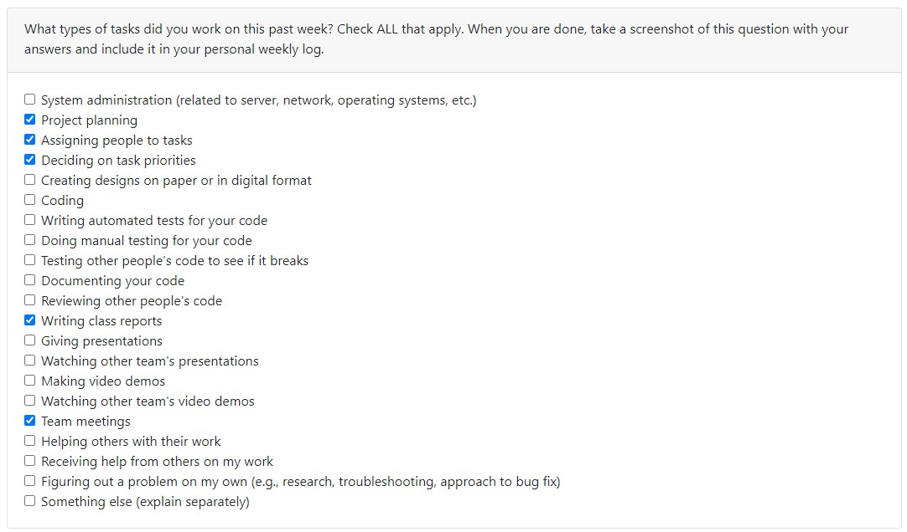
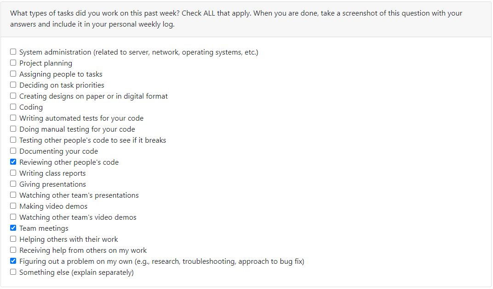
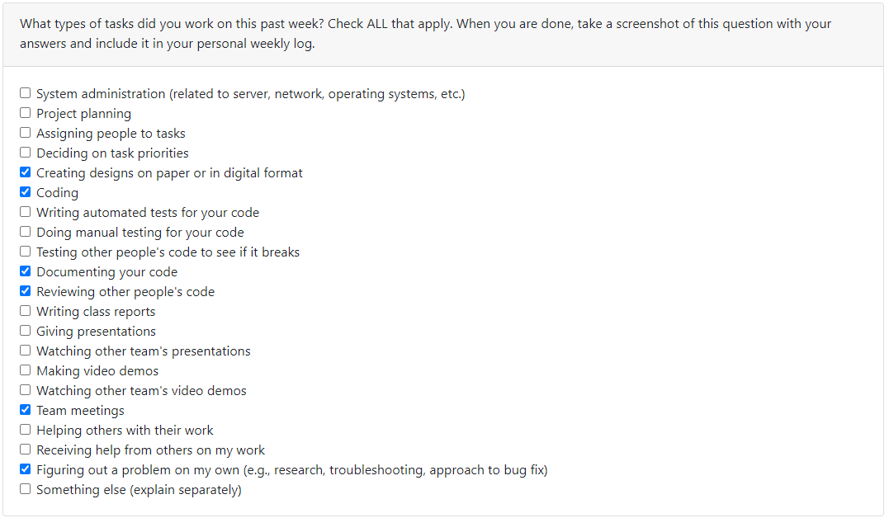
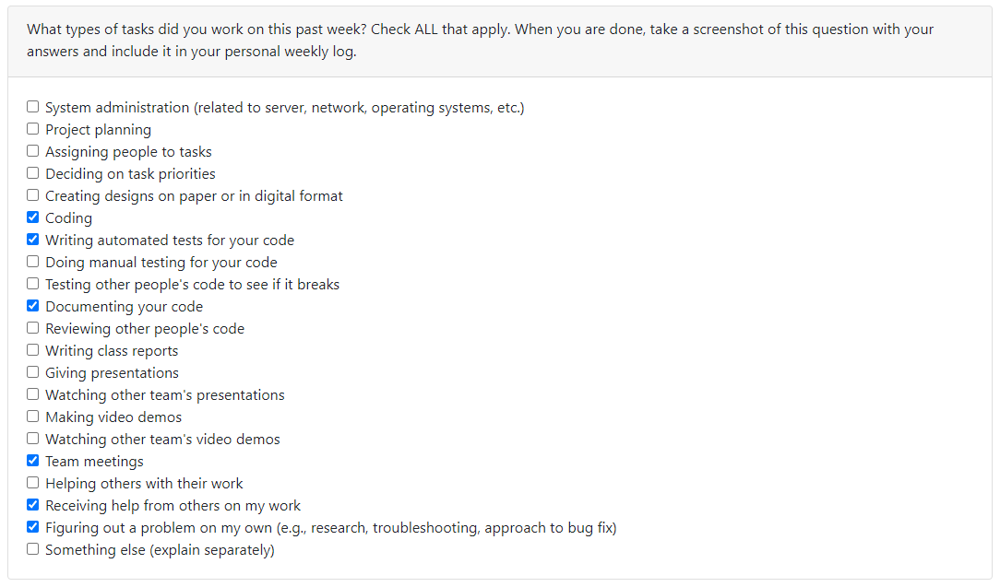
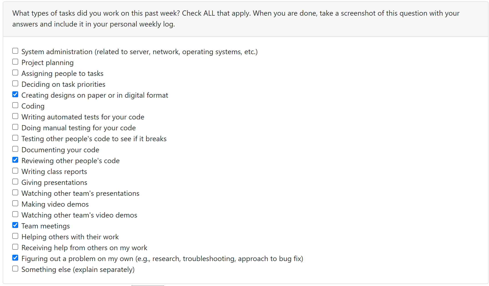
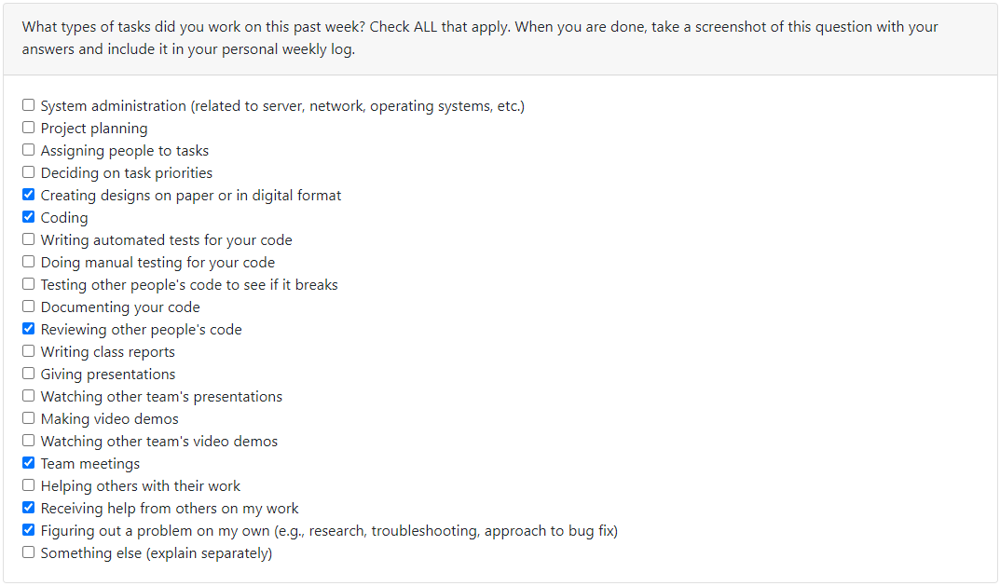
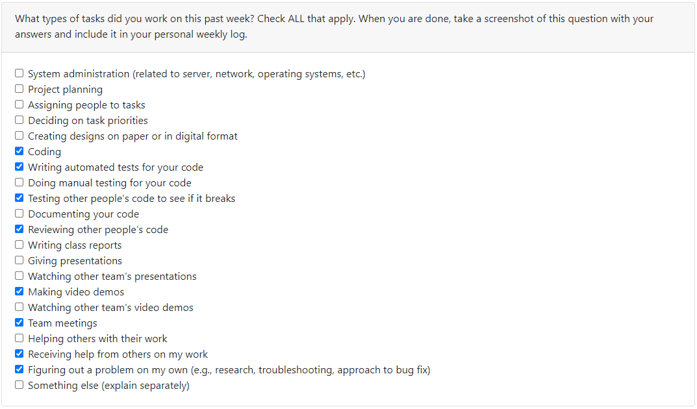
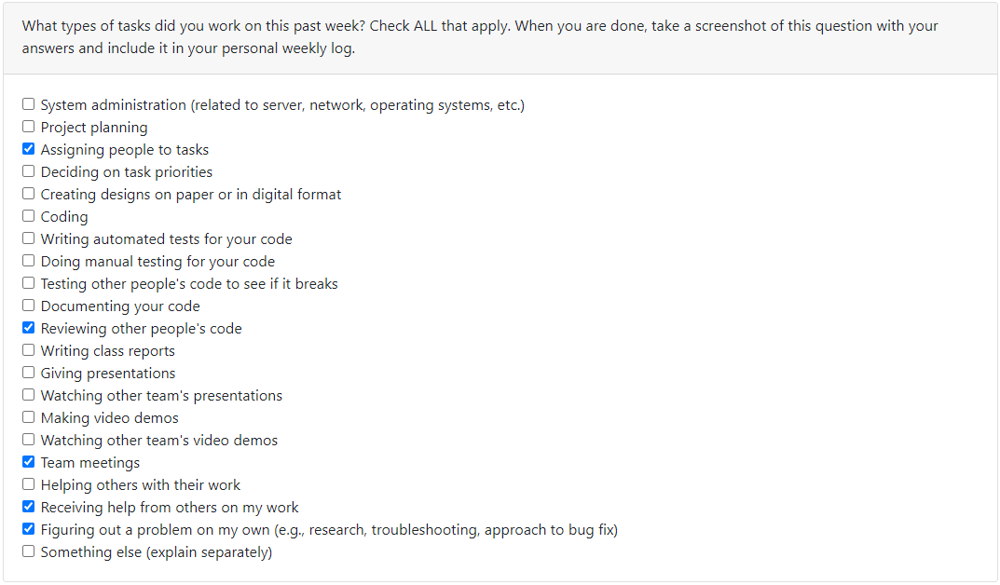
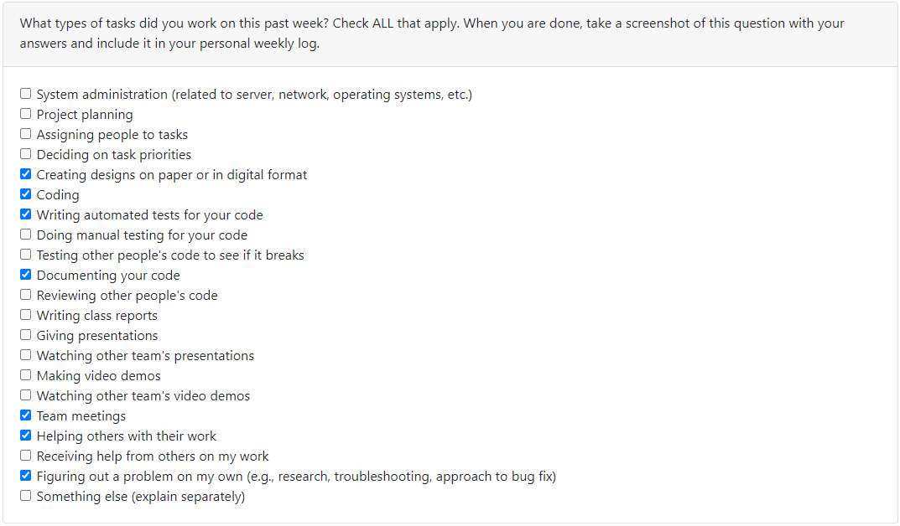

# Weekly Individual Log - Erin Hiebert

# SEMESTER 1

## Week 4 (25/09/2023 - 01/10/2023)

### Tasks Worked On

### Week Goals

-   This weeks goals included developing the project plan with team members
-   Included inperson meetings with the team to discuss project scope, tasks in the project, and chosen tech stack

### Additional Context

-   No additional context for this week

## Week 5 (02/10/2023 - 08/10/2023)

### Tasks Worked On

### Week Goals

-   Started going through tutorials on Next.js and a refresh on Node.js
-   Review project code and make sure I have an understanding of the foundations of our project. Additionally, I did some light research on what my teammates were completing to understand exactly how they were completing their tasks.

### Additional Context

-   Project set up was being done this week so not much coding on my end could be done this week. I was also waiting on user creation to be completed before starting my task. I will be doing my given task of log in and log out next week.

## Week 6 and 7 (09/10/2023 - 22/10/2023)

### Week Tasks

-   Log in/Log out/Sign up #34 (In progress)
-   Handle backend for sign up #45 (In progress)
-   Create sign up form UI #43 (In progress)
-   Complete NextJS Tutorial #91 (Personally Finished)

### Week Goals

-   Finished Next.JS tutorial
-   Mocked up high fidelity model of sign up and log in forms
-   Developed sign up form and backend functionality. All that remains on my current draft PR (34-logout-signup) is database fetching to check if the user already exists and testing the components.
-   Researching methods of sign up for a Next.JS application
-   Researched and troubleshooted local development environment problems, specifically issues with docker desktop

### Additional Context

-   The past two weeks were heavy with tutorial work and actually understanding building a Next.JS app

## Week 8 (23/10/2023 - 29/10/2023)

### Week Tasks

-   Log in/Log out/Sign up #34 (In progress)
-   Handle backend for sign up #45 (In review)
-   Create sign up form UI #43 (In review)

### Week Goals

-   Completed cypress testing for sign in page
-   Connected database to current sign up functions, now queries the database for already created accounts and also create accounts
-   Further researching methods of sign up for a Next.JS application in the terms of more specific UI elements
-   Finished up signup and addressed reviews on it

### Additional Context

-   My branch was heavily dependent on the database and that not being merged into master until friday evening prevented reviews on signup branch

## Week 9 (30/10/2023 - 05/11/2023)

### Week Tasks

-   Exporting database UML diagram from our prisma schema  #155 (In review)
-   Log in/Log out/Sign up #34 (Completed)

### Week Goals

-   Prepare and present mini demo
-   Finish up signup features for mini demo
-   Figured out how to convert project prisma schema into a UML diagram for ease when design document will be created

### Additional Context

-   NA

## Week 10 (06/11/2023 - 12/11/2023)

### Week Tasks

-   Exporting database UML diagram from our prisma schema  #155 (Completed)
-   Create Logo  #187 (Completed)
-   Mock Dashboard for Receiving Videos  #186 (In Progress)
-   User Interface Design  #62 (In Progress)
-   Dashboard Page for Receiving Videos  #58 (In Progress)

### Week Goals

-   Completed changes for UML export feature
-   Designed and created vectors for app logo, will be imported to app in a future PR
-   Begin mocks for the dashboard that deals with receiving video submissions to submission boxes

### Additional Context

-   I had 3 midterms this week on wednesday so the beginning of the week I did not complete any capstone work.  I'm not completely pleased with the amount of work I completed though I was more concerned with my exams and getting sufficient mental break afterwards.

## Week 11 and 12 (13/11/2023 - 26/11/2023)

### Week Tasks

-   Mock Dashboard for Receiving Videos  #186 (Complete)
-   User Interface Design  #62 (In Progress)
-   Dashboard Page for Receiving Videos  #58 (In Progress)
-   Combine Dashboard Components to Create Dashboard Page  #222 (In Progress)
-   Video creation  #64 (In Progress)

### Week Goals

-   Begin recording content that will be put into team video
-   Complete figma mocks for the receiving dashboard page and implement changes requested from team
-   Brainstorming some combinations of themes for app, specifically colour combinations
-   Began creating actual dashboard page and stitching together dashboard components

### Additional Context

-   I had a family emergency during the final days of reading week and that has caused me significant stress and mental drain, I am currently on the mend to finish the semester strong but this past week's performance on my end was affected.

## Week 13 (27/11/2023 - 03/12/2023)

### Week Tasks

-   User Interface Design  #62 (Completed)
-   Dashboard Page for Receiving Videos  #58 (Completed)
-   Combine Dashboard Components to Create Dashboard Page  #222 (Completed)
-   Video creation  #64 (Completed)
-   Replace Logo  #262 (Completed)

### Week Goals

-   Completed incoming and out-going submission box dashboard pages including stitching an API and some already completed components onto the page.  Also developed the UI as to reflect the mock I previously created for the dashboard pages.
-   Created tests for dashboard pages submission process and tests for the APIs
-   Uploaded logo I created onto our app
-   Recorded, edited, and finished design video

### Additional Context

-   It was a hard week and a hard milestone but now it is over yay

# SEMESTER 2

## Week 1 (08/01/2024 - 14/01/2024)

### Week Tasks

-   Research AWS Rekognition for face blurring  #289 (In Progress)

### Week Goals

-   My goal for this week was beginning on figuring out how to integrate face blurring in our app.  The discussion group on tuesday helped to direct some of the research but my lack of experience with AWS services proved to be difficult to easily understand the best way to complete the task.
-   Very possible that I will shift to a different task for next week.

### Additional Context

-   NA

## Week 2 (15/01/2024 - 21/01/2024)

### Week Tasks

-   Create mocks for submission detail pages  #304 (Completed)
-   Implement submission detail page for receiving submission boxes  #305 (In Review)
-   Detail page for submission boxes  #303 (In Progress)

### Week Goals

-   This week I pivoted from AWS faceblurring to creation of a detail page for our submission boxes
-   Mocks were made for both receiving boxes and user's requested submission boxes.  That is a user is able to view all videos submitted to their submission boxes from other users AND requested submission boxes will show the video that the user has submitted to it.
-   At present, I finished coding and testing the receiving submission boxes detail page(s)

### Additional Context

-   NA