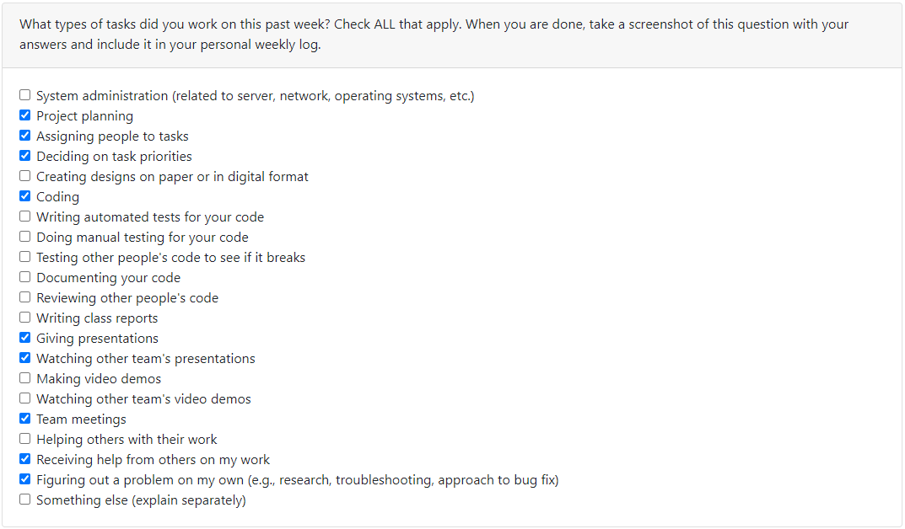
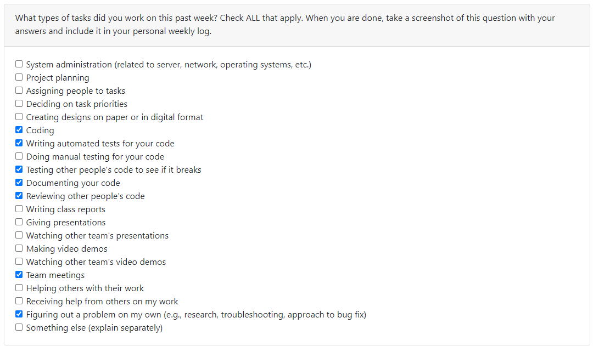
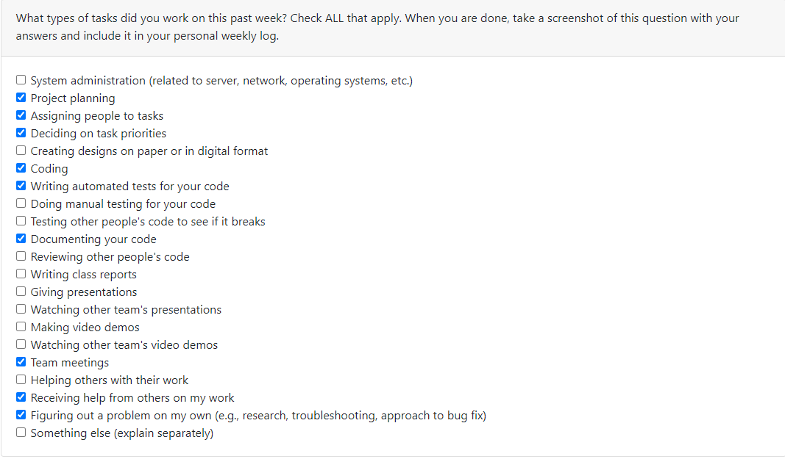
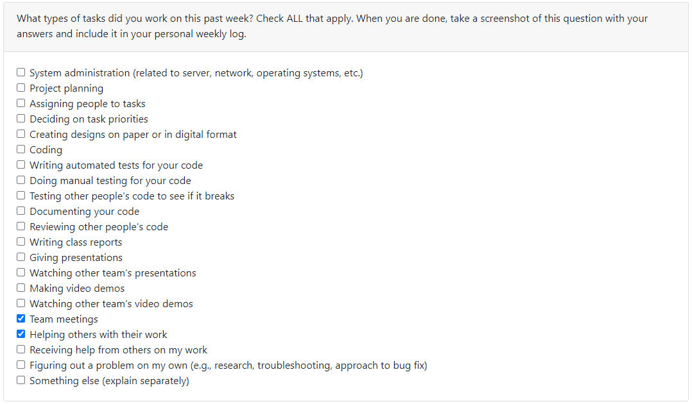
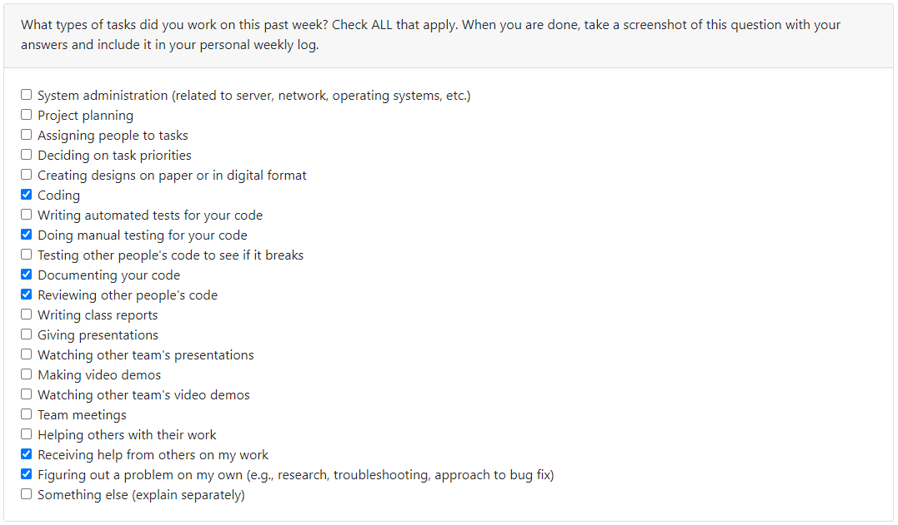
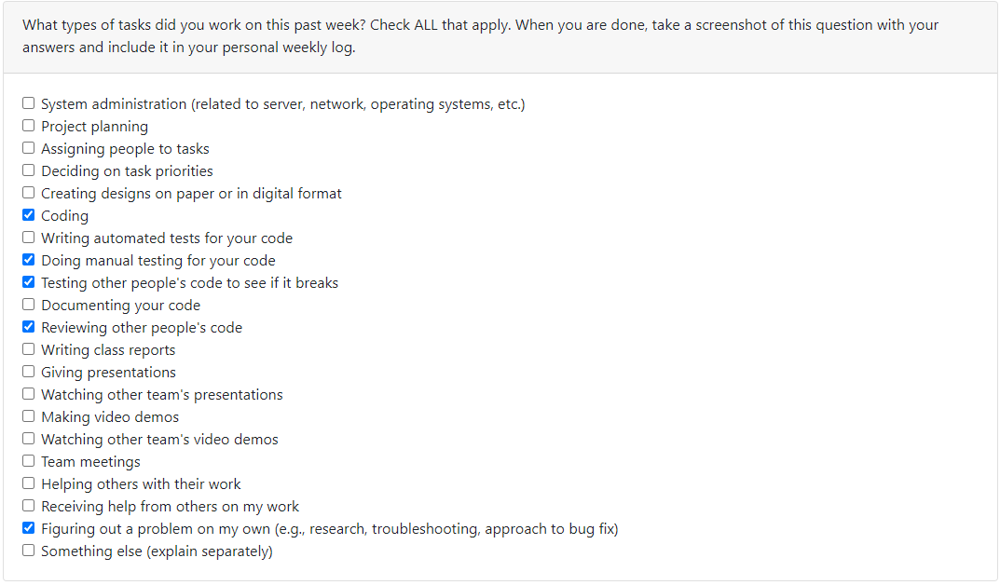
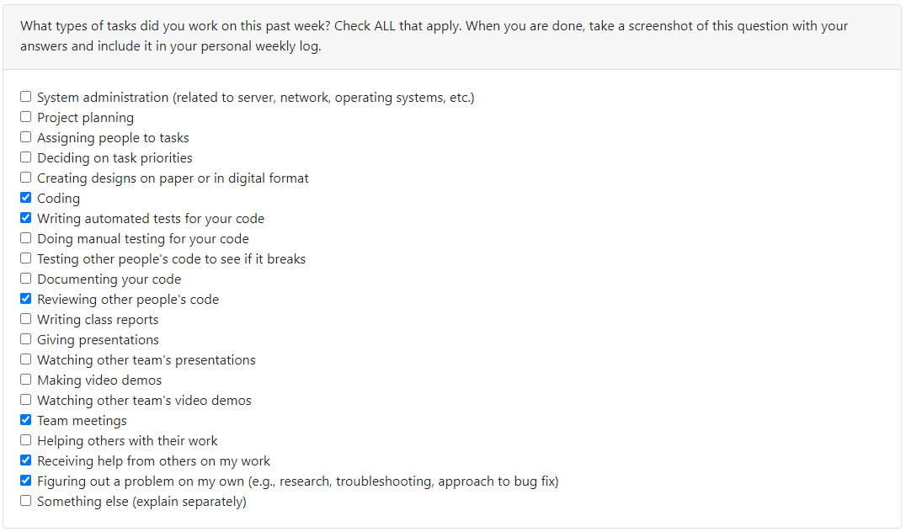

# Weekly Individual Log - Erin Hiebert

# SEMESTER 1

## Week 4 (25/09/2023 - 01/10/2023)

### Tasks Worked On

### Week Goals

-   This weeks goals included developing the project plan with team members
-   Included inperson meetings with the team to discuss project scope, tasks in the project, and chosen tech stack

### Additional Context

-   No additional context for this week

## Week 5 (02/10/2023 - 08/10/2023)

### Tasks Worked On

### Week Goals

-   Started going through tutorials on Next.js and a refresh on Node.js
-   Review project code and make sure I have an understanding of the foundations of our project. Additionally, I did some light research on what my teammates were completing to understand exactly how they were completing their tasks.

### Additional Context

-   Project set up was being done this week so not much coding on my end could be done this week. I was also waiting on user creation to be completed before starting my task. I will be doing my given task of log in and log out next week.

## Week 6 and 7 (09/10/2023 - 22/10/2023)

### Week Tasks

-   Log in/Log out/Sign up #34 (In progress)
-   Handle backend for sign up #45 (In progress)
-   Create sign up form UI #43 (In progress)
-   Complete NextJS Tutorial #91 (Personally Finished)

### Week Goals

-   Finished Next.JS tutorial
-   Mocked up high fidelity model of sign up and log in forms
-   Developed sign up form and backend functionality. All that remains on my current draft PR (34-logout-signup) is database fetching to check if the user already exists and testing the components.
-   Researching methods of sign up for a Next.JS application
-   Researched and troubleshooted local development environment problems, specifically issues with docker desktop

### Additional Context

-   The past two weeks were heavy with tutorial work and actually understanding building a Next.JS app

## Week 8 (23/10/2023 - 29/10/2023)

### Week Tasks

-   Log in/Log out/Sign up #34 (In progress)
-   Handle backend for sign up #45 (In review)
-   Create sign up form UI #43 (In review)

### Week Goals

-   Completed cypress testing for sign in page
-   Connected database to current sign up functions, now queries the database for already created accounts and also create accounts
-   Further researching methods of sign up for a Next.JS application in the terms of more specific UI elements
-   Finished up signup and addressed reviews on it

### Additional Context

-   My branch was heavily dependent on the database and that not being merged into master until friday evening prevented reviews on signup branch

## Week 9 (30/10/2023 - 05/11/2023)

### Week Tasks

-   Exporting database UML diagram from our prisma schema  #155 (In review)
-   Log in/Log out/Sign up #34 (Completed)

### Week Goals

-   Prepare and present mini demo
-   Finish up signup features for mini demo
-   Figured out how to convert project prisma schema into a UML diagram for ease when design document will be created

### Additional Context

-   NA

## Week 10 (06/11/2023 - 12/11/2023)

### Week Tasks

-   Exporting database UML diagram from our prisma schema  #155 (Completed)
-   Create Logo  #187 (Completed)
-   Mock Dashboard for Receiving Videos  #186 (In Progress)
-   User Interface Design  #62 (In Progress)
-   Dashboard Page for Receiving Videos  #58 (In Progress)

### Week Goals

-   Completed changes for UML export feature
-   Designed and created vectors for app logo, will be imported to app in a future PR
-   Begin mocks for the dashboard that deals with receiving video submissions to submission boxes

### Additional Context

-   I had 3 midterms this week on wednesday so the beginning of the week I did not complete any capstone work.  I'm not completely pleased with the amount of work I completed though I was more concerned with my exams and getting sufficient mental break afterwards.

## Week 11 and 12 (13/11/2023 - 26/11/2023)

### Week Tasks

-   Mock Dashboard for Receiving Videos  #186 (Complete)
-   User Interface Design  #62 (In Progress)
-   Dashboard Page for Receiving Videos  #58 (In Progress)
-   Combine Dashboard Components to Create Dashboard Page  #222 (In Progress)
-   Video creation  #64 (In Progress)

### Week Goals

-   Begin recording content that will be put into team video
-   Complete figma mocks for the receiving dashboard page and implement changes requested from team
-   Brainstorming some combinations of themes for app, specifically colour combinations
-   Began creating actual dashboard page and stitching together dashboard components

### Additional Context

-   I had a family emergency during the final days of reading week and that has caused me significant stress and mental drain, I am currently on the mend to finish the semester strong but this past week's performance on my end was affected.

## Week 13 (27/11/2023 - 03/12/2023)

### Week Tasks

-   User Interface Design  #62 (Completed)
-   Dashboard Page for Receiving Videos  #58 (Completed)
-   Combine Dashboard Components to Create Dashboard Page  #222 (Completed)
-   Video creation  #64 (Completed)
-   Replace Logo  #262 (Completed)

### Week Goals

-   Completed incoming and out-going submission box dashboard pages including stitching an API and some already completed components onto the page.  Also developed the UI as to reflect the mock I previously created for the dashboard pages.
-   Created tests for dashboard pages submission process and tests for the APIs
-   Uploaded logo I created onto our app
-   Recorded, edited, and finished design video

### Additional Context

-   It was a hard week and a hard milestone but now it is over yay

# SEMESTER 2

## Week 1 (08/01/2024 - 14/01/2024)

### Week Tasks

-   Research AWS Rekognition for face blurring  #289 (In Progress)

### Week Goals

-   My goal for this week was beginning on figuring out how to integrate face blurring in our app.  The discussion group on tuesday helped to direct some of the research but my lack of experience with AWS services proved to be difficult to easily understand the best way to complete the task.
-   Very possible that I will shift to a different task for next week.

### Additional Context

-   NA

## Week 2 (15/01/2024 - 21/01/2024)

### Week Tasks

-   Create mocks for submission detail pages  #304 (Completed)
-   Implement submission detail page for receiving submission boxes  #305 (In Review)
-   Detail page for submission boxes  #303 (In Progress)

### Week Goals

-   This week I pivoted from AWS faceblurring to creation of a detail page for our submission boxes
-   Mocks were made for both receiving boxes and user's requested submission boxes.  That is a user is able to view all videos submitted to their submission boxes from other users AND requested submission boxes will show the video that the user has submitted to it.
-   At present, I finished coding and testing the receiving submission boxes detail page(s)

### Additional Context

-   NA

## Week 3 (22/01/2024 - 28/01/2024)

### Week Tasks

-   Implement submission detail page for receiving submission boxes  #305 (Completed)
-   Detail page for submission boxes  #303 (In Review)
-   Detail page for submitted to submission boxes  #339 (In Review)
-   Modifying submission boxes  #72 (In Progress)

### Week Goals

-   The 'My Submission Boxes' detail page(s) was reviewed, changes made, and merged this week
-   For the 'Requested Submission Boxes' detail page(s) I completed coding and testing the task, it is in a review stage and changes have been started on.
-   I also started the modifying submission boxes task that will include editing the title and description of the submission boxes.

### Additional Context

-   NA

## Week 4 (29/01/2024 - 04/02/2024)

### Week Tasks

-   Detail page for submission boxes  #303 (In Review)
-   Detail page for submitted to submission boxes  #339 (In Review)
-   Modifying submission boxes  #72 (In Progress)

### Week Goals

-   For the 'Requested Submission Boxes' detail page(s) I completed some code review changes that were very much beyond my capibilities and knowledge at the time, spending 6+ hours on monday to try and merge this feature in time for the peer reviews, this did not end up happening.
-   Modifying Submission Boxes was put on the back burner for this week as the detail pages took priority so only preparations for this PR was done.
-   This week the team also completed the peer evalutations in class, I guided two users through the process and noted where our platform struggled.
-   Our team also had a meeting this week to organize our peer evaluation results into tasks to improve our app.

### Additional Context

-   I ran into a lot of issues in regards to my knowledge in nextJS and the programming abilities I currently possess

## Week 5 (05/02/2024 - 11/02/2024)

### Week Tasks

-   Detail page for submission boxes  #303 (Completed)
-   Detail page for submitted to submission boxes  #339 (Completed)
-   Modifying submission boxes  #72 (In Progress)

### Week Goals

-   More requested changes were made on Detail page for submitted to submission boxes, with a lot of work into restructuring the API and figuring out more advanced techniques with APIs
-   Some tests were modified and changed slightly in the Detailed submission boxes pages
-   The team also met this week to go over our website's logic pathing, we discussed UI changes and page progression changes
-   Modifying Submission Boxes had no new commits for this week

### Additional Context

-   NA

## Week 6 (12/02/2024 - 18/02/2024)

### Week Tasks

-   Modifying submission boxes  #72 (In Progress)

### Week Goals

-   No work for capstone was done by me this week

### Additional Context

-   I had a midterm and 2 tests this week in my other courses along with multiple assignment due so capstone wasn't a huge priority for me.  I plan to do work on capstone during the reading break and will include it in the week after the break's log.

## Week 8 (19/02/2024 - 03/03/2024)

### Week Tasks

-   Modifying submission boxes  #72 (In Progress)
-   Redirects should be cleared when logging out  #366 (Completed)

### Week Goals

-   This week I wanted to get some tasks done that would fix bugs related to the peer evaluations, that being the redirection bugs after a user logs out of our system. This was completed this week
-   Work on modifying submission boxes was done.  It now uses formik and yup for form validation on the front end, the ui was improved as well.  The date picker was also added to the page to allow for users to change the date of submission on the box.  Work on the back end was started and some difficulty has been hit with transferring the data between the front and backend.

### Additional Context

-   Same as last week I had more midterms this week and no work was completed during the reading week as I wanted to try and get some proper rest so that I can push through the rest of the semester without burnout.

## Week 9 (04/03/2024 - 10/03/2024)

### Week Tasks

-   Modifying submission boxes  #72 (Completed)

### Week Goals

-   This week's tasks included finishing up the modify submission box page.  Last week the frontend was refactored to include a formik form and validation, this week was work on connecting said form to the backend and getting it to update properly on the database.  Some difficulties were faced when trying to transfer over the data from the form to the backend and processing the data to be put into the database, (formik only allows the transfer of strings or blobs).
-   Tests were also written for the modifying submissions task, some difficulty was encountered with testing a DatePicker MUI object and in testing the MUI form with initial values present instead of an empty field
  
### Additional Context

-  N/A

## Week 10 (11/03/2024 - 17/03/2024)

### Week Tasks

-   Add tab title for pages  #373 (In-Progress)
-   Disable editing while video is processing  #476 (In-Progress)

### Week Goals

-   This week's I started work on adding titles to tabs when viewing certain pages in our app, at the moment all static pages have a title (eg, dashboard, login) and in the next week I will be figuring out how to add a dynamic title to other pages (eg. adding video titles to the title, or submission box)
-   Also started the fix of disabling a user from editing a video when said video is still being processed in AWS, both front and backend has been modified and the only thing left is more rigorous testing and reviews.

### Additional Context

-  N/A

## Week 11 (18/03/2024 - 24/03/2024)

### Week Tasks

-   Add tab title for pages  #373 (Completed)
-   Disable editing while video is processing  #476 (In-Progress)

### Week Goals

-   This week I completed the tab titles for each page in our project, most of the time spent on this PR was researching methods of changing the metadata on a dynamic client page. Unfortunately with the way that we built our project and the use of client components metadata is not able to be used. In order for our pages to have dynamic titles a full page reformat would be needed for both the video and submission box pages, which at this point of the project would be too large of a task.
-   For the disable editing while video is processing PR I started to develop tests for the update API on videos.

### Additional Context

-  N/A
