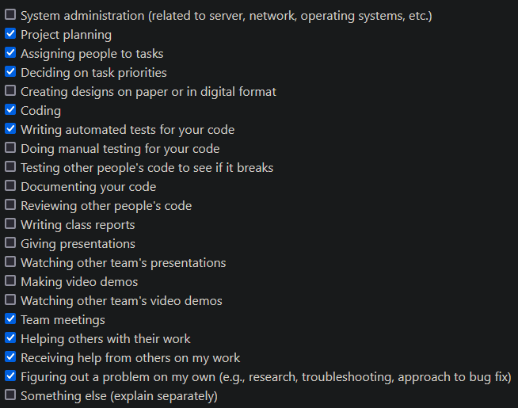
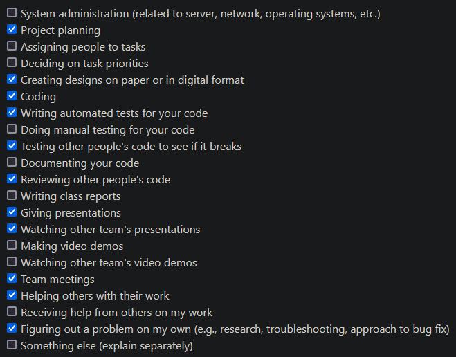

# Weekly Individual Log - Justin Schoenit

## Week 10 (Mar 11 - Mar 17)

### Tasks

### My Contributions this week

- Enforced submission box close dates by updating the frontend to show a message instead of prompting the user to submit. Also updated the backend to reject requests to submit a video to a closed submission box
- The dashboard page needed a good refactor to use more appropriate NextJS hooks to improve safety and responsiveness. There were also many more API requests being made than was necessary and was actually slowing down the page. This PR is finished and is in review.

### Goals for the coming week

- Continue polishing up the site for final submission

### Additional Context

N/A

## Week 9 (Mar 04 - Mar 10)

### Tasks

### My Contributions this week

- Added ability to navigate to a specific tab on the dashboard via the url
- After discussion, we decided against being able to submit a video from the video page due some ui and technical challenges, so I removed that from my PR. But I finished up the ability to submit from a submission box as I was unblocked earlier in the week.
- Fixed a number of tests in Teresa's PRs

### Goals for the coming week

- Get all new UI changes integrated together and merged to main
- There are a number of small issues that can be worked on

### Additional Context

Seth was goated at the beginning of the week to pull together our progress to show for peer testing #2

## Week 7/8 (Feb 19 - Mar 03)

### Tasks

### My Contributions this week

- Fixed a bug that didn't allow the user to navigate back to a submission box via in page buttons after clicking a video that had been submitted to the box
- Refactored email sending so that there is a template email instead of duplicating code
- Email users when a video fails to upload

### Goals for the coming week

- I was unable to complete my goal that I had last week since it is being blocked by [#449](https://github.com/COSC-499-W2023/year-long-project-team-3/pull/449). Hopefully that will be merged early this week and I can again try to finish that as my goal for this week.

### Additional Context

N/A

## Week 6 (Feb 12 - Feb 18)

### Tasks

### My Contributions this week

- I worked on part of the redesign this week that allows the user to submit a video from both the video page and the submission box page. The changes I focussed on this week were on the backend side of things by re-writing the API that allows us to submit a video to a submission box. The old API was not flexible enough to achieve what we want with the new API. I also wrote a bunch of tests for my new API.

### Goals for the coming week

- Finish the frontend portion of the change I worked on in the last week.

### Additional Context

N/A

## Week 5 (Feb 5 - Feb 11)

### Tasks

### My Contributions this week

- I reconfigured our linting as it had some issues
  - Commits took a long time due to husky running pre-commit checks on our ever-growing code base. I just removed it since GitHub Actions already checks the linting 
  - Prettier (a code formatter) was conflicting with eslint on a couple rules making local linting not work as intended. Upon review, prettier was not actually needed, so it was removed as well
  - I fixed the lint GitHub Actions to not check the prettier formatting, which, it turns out, never worked anyway (the eslint action worked though)
- We had a brainstorming session to work out a few kinks in the user experience of the site which resulted in more tasks, and a couple page redesigns and workflow changes
- I implemented one of those changes which was a redesign of the dashboard sidebar to use different wording to make the purpose of each tab clearer. This meant I had to change the functionality of each tab so that it shows the intended stuff. A lot of tests had to be fixed after these changes (25% of them).

### Goals for the coming week

- I will keep pulling from our list of things to be fixed based on our peer testing feedback and our redesign

### Additional Context

Some of my progress was blocked due to dependency on the submission boxes not being merged yet, so I was a bit less productive on the coding front than I had hoped. But that is now merged, so I will be able to continue those tasks this coming week.

## Week 4 (Jan 29 - Feb 04)

### Tasks

### My Contributions this week

- Hotfix right before peer testing that gave submission box owners permission to view the videos submitted to their box
- Did peer testing
- We had a meeting to discuss and organize the feedback gained during the peer testing which resulted in a large list of things for us to fix which we divided among ourselves
- Fixed a bug that made emails case-sensitive for the purpose of login
- Added the ability for email verification emails to be automatically sent instead of requiring the user to click "send email". This was a feedback from peer testing as some users didn't notice the button and went straight to their inbox

### Goals for the coming week

- I will keep pulling from our list of things to be fixed based on our peer testing feedback

### Additional Context

N/A

## Week 3 (Jan 22 - 28)

### Tasks

### My Contributions this week

- Send notifications to people who have been invited to submit a video. This mostly involved being able to redirect the user back to the submission box when they inevitably click the link to the submission box and are required to login/signup [#306](https://github.com/COSC-499-W2023/year-long-project-team-3/pull/306)
- Fixed the test report generated by the CI pipeline that comments onto the PR what the results of our automated tests were. It always created a new comment rather than updating an existing one. This made PRs cluttered with lots of comments. This wasn't a lot of lines of code, but it took a fair bit of research to find the right configuration and the best practices as it concerned providing permissions to the action that generates the comment. [#337](https://github.com/COSC-499-W2023/year-long-project-team-3/pull/337)

### Goals for the coming week

- We will need to address the feedback from the peer review testing #1
- Other tasks will need to be decided later this week

### Additional Context

N/A

## Week 2 (Jan 15 - 21)

### Tasks

### My Contributions this week

- Write tests for email verification
- Bug fix email verification
  - Use middleware.ts file for checking that a user's email is verified before allowing them into most of the website
  - Automatically verify the emails of users who log in with Google
  
### Goals for the coming week

- Send email notifications to users when they're requested to a submission box
  - This requires changes in the way redirects are handled
  - Write tests for this

### Additional Context

N/A

## Week 1 (Jan 8 - 14)

### Tasks

### Goals

- face blur (Erin, Teresa)
- UI fixes for consistency (Teresa)
- email verification / email invites (Justin)
- batch messages to everyone in submission box or specific users (Seth)
- Filter/search for videos by title, date, and person that submitted (K)
- detail/edit page for videos (K) -> make mock first!
- detail/edit page for submission boxes (Seth) -> make mock first!

### My Contributions

- Set up Amazon SES for email sending
- Wrote frontend and backend for verifying email address
  - DB change
  - Had issues modifying middleware.ts for verifying if a user has verified their email address before allowing them to access certain page that might require them to have a verified email address

### Additional Context

N/A

## Week 13 (Nov 27 - Dec 3)

### Tasks

### Goals

- Get some pages mocked and implemented
- Get video upload working
- Get AWS video pipeline working/researched

### My Contributions

- Updated database design with submission boxes
- Wrote API for creating submission boxes in the database and inviting people to them
- Integrated API with Teresa's submission box UI
- Tested the integration
- Worked on fixing tests

### Additional Context

N/A

## Week 11/12 (Nov 13 - Nov 26)

### Tasks

### Goals

- Get some pages mocked and implemented
- Get video upload working
- Get AWS video pipeline working/researched

### My Contributions

- Critiqued mocks (cause I can't actually design it my self)
- Implemented the video player to scale with the page
- Created a video preview/edit page

### Additional Context

Turns out web dev is hard? I spent more time than anticipated trying to implement a webpage since I am not experienced in web design

## Week 10 (Nov 6 - Nov 12)

### Tasks

### Goals

- Continue UI design mocks
- Start implementing some pages
- Choose colors
- Flush out dashboard mock

### My Contributions

- Contributed to mocks
- Implemented a basic video preview page
- Discussed color choice

### Additional Context

Nope

## Week 9 (Oct 30 - Nov 5)

### Tasks

### Goals

- Complete signup/login/logout task
- Fix broken deployment
- Prepare presentation
- Deliver presentation
- Start UI design for various pages that will be developed this sprint

### My Contributions

- Put that Cypress tutorial to use testing signup form
- Practiced presentation
- Gave presentation
- Started Figma design of video preview page

### Additional Context

Was a lot of work at the beginning of the week to wrap up incomplete tasks before the presentation, and then prepared for the presentation, so the latter half of the week didn't get as many hours allocated to it

## Week 8 (Oct 23 - Oct 29)

### Tasks

### Goals

- Implement login/logout
- Do tutorials for stuff on tech stack

### My Contributions

- [React tutorial](https://react.dev/learn/tutorial-tic-tac-toe)
    - Repo it was completed on: https://github.com/justino599/justin-learns-react
- [Cypress tutorial](https://docs.cypress.io/examples/tutorials)
  - Repo it was completed on: https://github.com/justino599/justin-learns-cypress
- Did a bunch of code review/trying to get it working locally

### Additional Context

Was a lot of learning this week and debugging platform specific errors

### Week 6/7 (Oct 9 - Oct 22)

### Tasks

### Goals

- Look into AWS S3/WebRTC
- Setup Cypress
- Implement login/logout
- Create some mocks
- User creation on database side & setup tests for it
- Setup database(s)
- Dockerization
- Deploy with Vercel
- Do tutorials for stuff on tech stack

### My Contributions

- Setup 2 databases
- Worked on Figma mocks
- Did NextJS tutorial
- Did a bunch of code review

### Additional Context

Was a lot of learning this week and making sure that testing stuff was up and running

## Week 5 (Oct 2 - Oct 8)

### Tasks

### Goals

- Setup NextJS project
    - Including many other packages to be integrated with Next
- Setup Kanban board with all features/tasks that we discussed last week in the plan
- Start getting user creation/login going

### My Contributions

- Help with NextJS setup
- Configure formatter and linter
- Setup Github Actions to check formatting and lint
- Reviewed a lot of code

### Additional Context

None

## Week 4 (Sept 25 - Oct 1)

### Tasks

### Goals

- Build project plan
    - Compile list of features
    - Review mock-ups to determine what features we want
    - Assign features to people
    - Review project plan after it was written

I was present at all meetings. We discussed at length what we wanted to put on our project proposal.

### Additional Context

This week is just a project planning week for us as we want to make sure that we are all on the same page in terms of
who is doing what and when. Next week we will start with the project.
