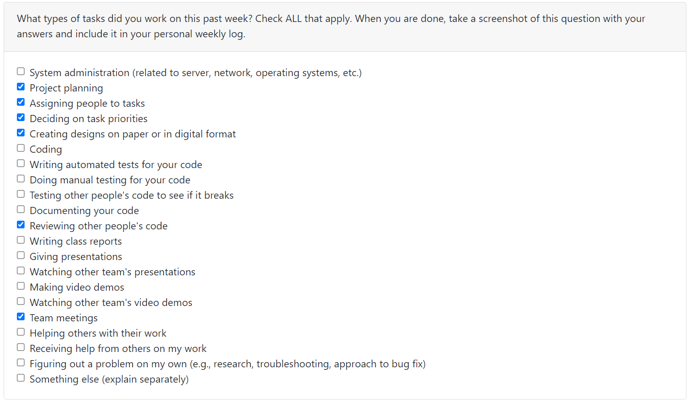

# K Phan
## Term 1 Week 4 (September 25 - October 10)

### Week's Goals
- Finish project proposal (COMPLETED)
- Work on design mocks (IN PROGRESS)

### Tasks Worked on
- Brainstormed a list of ideas
- Adjusted the project list team came up
- Contributed to project proposal
- Started on a little bit of design

### Teamformation Report

