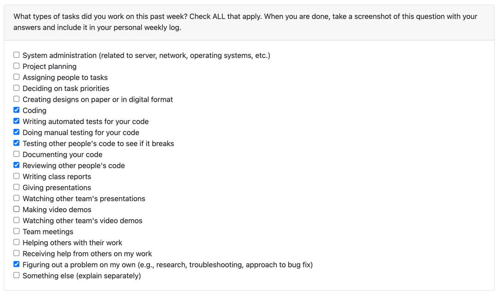

# K Phan

## Term 2 Week 12 (March 25, 2024 - March 31, 2024)

### Week's Goals
- Fix permission bug on view video through submission box

### Tasks Worked On
- Fix permission bug on view video through submission box (https://github.com/COSC-499-W2023/year-long-project-team-3/pull/526)
- Additional handling for unsubmiting video to submission box (https://github.com/COSC-499-W2023/year-long-project-team-3/pull/526)

### Teamformation Report

## Term 2 Week 10 (March 11, 2024 - March 17, 2024)

### Week's Goals
- Fix UI for dashboard since J and S gave up
- Refactor the dynamic routing since the code will be exposed to the public

### Tasks Worked On
- Fix UI for dashboard (https://github.com/COSC-499-W2023/year-long-project-team-3/pull/501)
- Refactor the dynamic routing (https://github.com/COSC-499-W2023/year-long-project-team-3/pull/503)

### Teamformation Report

## Term 2 Week 9 (March 04, 2024 - March 10, 2024)

### Week's Goals
- Resolve comments in Delete video feature PR and merge

### Tasks Worked On
- Delete video feature (https://github.com/COSC-499-W2023/year-long-project-team-3/pull/455)
- Fix bug on email verification to prevent sending multiple when user already verified (https://github.com/COSC-499-W2023/year-long-project-team-3/pull/483)

### Teamformation Report

## Term 2 Week 8 (February 25, 2024 - March 03, 2024)

### Week's Goals
- Delete video feature (COMPLETE)

### Tasks Worked On
- Delete video feature (https://github.com/COSC-499-W2023/year-long-project-team-3/pull/455)
- Bonus: fix bug of submission box not showing up when signing up by Google (https://github.com/COSC-499-W2023/year-long-project-team-3/pull/458)

### Teamformation Report

## Term 2 Week 5 (February 05, 2024 - February 11, 2024)

### Week's Goals
- Fix permission issue with Video Detail Page (COMPLETE)
- Fix scroll bar issue on Video Detail Page (COMPLETE)

### Tasks Worked On
- Fix permission issue with Video Detail Page (https://github.com/COSC-499-W2023/year-long-project-team-3/pull/415)
- Fix scroll bar issue on Video Detail Page (https://github.com/COSC-499-W2023/year-long-project-team-3/pull/415)
- Additional: refactor videos API + Submission box API (https://github.com/COSC-499-W2023/year-long-project-team-3/pull/415)
- Additional: fix videos API return duplicate videos (https://github.com/COSC-499-W2023/year-long-project-team-3/pull/415)

### Teamformation Report

## Term 2 Week 4 (January 29, 2024 - February 04, 2024)

### Week's Goals
- Understand the peer testing feedback
- Split reviews into tasks and assign to team members

### Tasks Worked On
- Address one of the peer testing feedback (https://github.com/COSC-499-W2023/year-long-project-team-3/pull/405)
- Team meeting for peer testing feedback analysis

### Teamformation Report

## Term 2 Week 3 (January 22, 2024 - January 28, 2024)

### Week's Goals
- Finish testing detailed video page (COMPLETE) <- 1 feature
- Finish fixing the bug that causes the video to not play (COMPLETE) <- this tasks take really long

### Tasks Worked On
- Detailed page for video (https://github.com/COSC-499-W2023/year-long-project-team-3/pull/312)
- Fix API bug that causes the video to not play (https://github.com/COSC-499-W2023/year-long-project-team-3/pull/312)

### Teamformation Report

## Term 2 Week 2 (January 15, 2024 - January 21, 2024)

### Week's Goals
- Finish detailed page for video (COMPLETE, NOT TESTED)
- Finish edit video page + backend (COMPLETE, NOT TESTED)
- Test new features (NOT COMPLETED)

### Tasks Worked On
- Detailed page for video (https://github.com/COSC-499-W2023/year-long-project-team-3/pull/312)
- Helped with renaming files before uploading to S3
- Asked other teams on how to blur face with Recoknition (Shout out to Jan from Team 9)

### Teamformation Report

## Term 2 Week 1 (December 04, 2023 - January 14, 2024)

### Week's Goals
- Video Dashboard Page (both UI + backend) (COMPLETED)
- Dashboard Searchbar (IN REVIEW)
- Mock up for detailed video page (IN REVIEW)

### Tasks Worked On
- Video Dashboard Page (both UI + backend)
  - https://github.com/COSC-499-W2023/year-long-project-team-3/issues/277
  - https://github.com/COSC-499-W2023/year-long-project-team-3/issues/275
  - https://github.com/COSC-499-W2023/year-long-project-team-3/issues/254
- Refactored code structure for dashboard
- Dashboard Searchbar
  - https://github.com/COSC-499-W2023/year-long-project-team-3/issues/288
- Mock up for detailed video page
- Reviewed PRs

### Teamformation Report

## Term 1 Week 13 (November 27, 2023 - December 03, 2023)

### Week's Goals

- Dashboard UI (COMPLETED)
- Help teammates to finish up their tasks (COMPLETED)
- Make sure no tests fail in production (COMPLETED)
- Complete the project report (COMPLETED)

### Tasks Worked On
- Dashboard side panel
- API for getting videos
- API for getting submission boxes
- API for submitting videos to submission boxes
- Test debugging for submission box E2E tests
- Helped with debugging UI issues

### Teamformation Report

## Term 1 Week 11 and 12 (November 13, 2023 - November 26, 2023)

### Week's Goals
- Finish uploading video to AWS S3
- Implement UI for dashboard

### Tasks Worked On
- Finished uploading video to AWS S3
- Implemented VideoCard, VideoList, and DashboardSidebar components
- Fixed some minor bugs

### Teamformation Report

## Term 1 Week 10 (November 06, 2023 - November 12, 2023)

### Week's Goals
- Implementing video for backend

### Tasks Worked On
- Helped teammates with UI mocks for previewing videos
- Designed and Researched AWS tools to use for video storage for secured video sending and saving
- Reviewed PRs
- Monitored repo health

### Teamformation Report

## Term 1 Week 9 (October 30, 2023 - November 05, 2023)

### Week's Goals

- Have a decent demo
- Touch up the pipeline for project

### Tasks Worked on
- Helped teammates with Sign Up features
- Helped teammates with Sign In features
- Refactor project structure
- Helped with preparing for demo
- Reviewed a lot of PRs
- Restructured pipeline for CI/CD

### Teamformation Report

## Term 1 Week 8 (October 23, 2023 - October 29, 2023)

### Week's Goals

- Finish testing user creation feature
- Help teammates with log in and sign up feature

### Tasks Worked on

- Merged user creation with google log in feature
- Added new workflow for branch deployment
- Cypress sign in by Google test can now run without Google OAuth
- Logger in middleware to log requests

### Teamformation Report

## Term 1 Week 6 and 7 (October 09, 2023 - October 22, 2023)

### Week's Goals

- Finish testing user creation feature

### Tasks Worked on

- Set up deployment for Preview
- Set up End-to-End testing with Cypress
- Set up Google Test Account
- Set up Vercel alias for Preview deployment
- Set up Cypress Cloud for test monitoring
- Upgraded Github Actions to run Cypress on Preview deployment
- Upgraded Github Actions to use test database
- Added Cypress tests for user creation feature
- Added logging for project
- Added saving logs in Github Actions

### Teamformation Report

## Term 1 Week 5 (October 02, 2023 - October 08, 2023)

### Week's Goals

- Finish user creation feature (COMPLETED)
- Test feature (NOT STARTED)

### Tasks Worked on

- Set up Prisma ORM to clear dependencies for user creation
- Log in by Google OAuth
- Log in by credentials
- Create database models for users, videos, and accounts
- API endpoints for auth

### Teamformation Report

## Term 1 Week 4 (September 25, 2023 - October 01, 2023)

### Week's Goals

- Finish project proposal (COMPLETED)
- Work on design mocks (IN PROGRESS)

### Tasks Worked on

- Brainstormed a list of ideas
- Adjusted the project list team came up
- Contributed to project proposal
- Started on a little bit of design

### Teamformation Report

### Additional Context

- No further explanation needed
