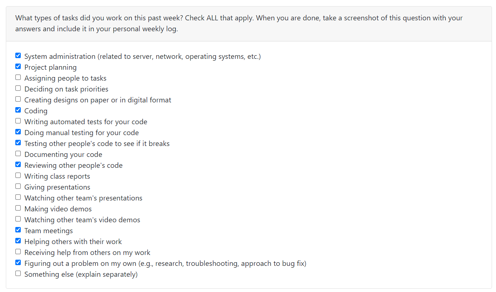

# Seth Akins Personal Log

## Week 4 (25/09/2023 - 01/10/2023)

### Task Breakdown

### Goals

- This week my group primarily worked on the project plan
- We had several group meetings to determine our features for the project and for writing the
  project plan
- We finished the plan, and wrote our weekly team and individual logs

### Tasks

- For this week, I worked and completed the following tasks:
    - [Team Log Week 4](https://github.com/COSC-499-W2023/year-long-project-team-3/issues/4)
    - [Complete and add project plan to repo](https://github.com/COSC-499-W2023/year-long-project-team-3/issues/8)
    - [Create Project Board](https://github.com/COSC-499-W2023/year-long-project-team-3/issues/2)
    - [Complete Individual Logs for Week 4](https://github.com/COSC-499-W2023/year-long-project-team-3/issues/11)
- The following task is in progress:
    - [Update Project Board with Features](https://github.com/COSC-499-W2023/year-long-project-team-3/issues/10)

### Additional Context

- We did not have much in terms of tasks as this week was mostly a planning week with a bunch of meetings to brainstorm
  and write the project plan.

## Week 5 (02/10/2023 - 08/10/2023)

### Task Breakdown

### Goals

- This week I started setting up the project for the team and completing tutorials for the parts of our tech stack I am
  unfamiliar with
- This included initializing the NextJS project, setting up the database with docker, and adding Material UI (a
  component library) to the project
- I also started working on the NextJs tutorial

### Tasks

Completed Tasks:

- [Team Log Week 5](https://github.com/COSC-499-W2023/year-long-project-team-3/issues/93)
- [Individual Logs Week 5](https://github.com/COSC-499-W2023/year-long-project-team-3/issues/94)
- [Initialize Repo with NextJS Project](https://github.com/COSC-499-W2023/year-long-project-team-3/issues/19)
- [Setup Docker Container for Database](https://github.com/COSC-499-W2023/year-long-project-team-3/issues/20)
- [Add SASS to Project](https://github.com/COSC-499-W2023/year-long-project-team-3/issues/27)
- [Add Jest to Project for Unit tests](https://github.com/COSC-499-W2023/year-long-project-team-3/issues/28)

In Progress Tasks:

- [Complete NextJs Tutorial](https://github.com/COSC-499-W2023/year-long-project-team-3/issues/91)
- [Initial Project Setup](https://github.com/COSC-499-W2023/year-long-project-team-3/issues/24)

### Additional Context

- This week our team was just focused mainly on project setup and tutorials, so there is not an immense amount of
  feature completion yet and stuff like testing is not currently available

## Week 6 and 7 (09/10/2023 - 22/10/2023)

### Tasks Breakdown

### Goals

- The main goal was progress towards completing the required features for the first milestone.
- The project setup task is almost complete, and should be finished in the next few days
- I also completed the Next.Js tutorial
- Additionally, I was able to automatically deploy the project, which is a feature that was not required by this
  milestone. This included a lot of research, and setting up CD (so you get a preview build and a deployment build).
- The last thing was that I started on designing a landing page for our website. The design mock is finished, but I have
  not started implementing it yet.
    - The goal is to also have this done for the Mini Presentation Milestone (although it was not required)

### Tasks

#### Completed Tasks

- [Complete NextJS Tutorial](https://github.com/COSC-499-W2023/year-long-project-team-3/issues/91)
- [Setup Project Deployment](https://github.com/COSC-499-W2023/year-long-project-team-3/issues/106)
- [Implement CI for Cypress Tests](https://github.com/COSC-499-W2023/year-long-project-team-3/issues/103)

#### In Progress Tasks

- [Initial Project Setup](https://github.com/COSC-499-W2023/year-long-project-team-3/issues/24)
- [Create Landing Page](https://github.com/COSC-499-W2023/year-long-project-team-3/issues/111)

### Additional Context

- Our group is still getting used to working with NextJS, and our velocity currently looks low but I think that is
  mainly due to that we are not working on many of the project features currently, but still doing a lot of research,
  meetings, and tutorials

## Week 8 (23/10/2023 - 29/10/2023)

### Tasks Breakdown

### Goals

- The main goal this week was to finish the parts of the first milestone that are required.
- For me, this mainly involved implementing the landing page of the website, and reviewing other people's code.
- I also helped some others with issues they experienced with their tasks

### Tasks

#### Completed Tasks

- [Create Theme for Material UI](https://github.com/COSC-499-W2023/year-long-project-team-3/issues/119)
- [Minor Fixes](https://github.com/COSC-499-W2023/year-long-project-team-3/issues/121)
- [Create Landing Page](https://github.com/COSC-499-W2023/year-long-project-team-3/issues/111)
- [Initial Project Setup](https://github.com/COSC-499-W2023/year-long-project-team-3/issues/24)

#### In Progress Tasks

- N/A

### Additional Context

Overall, I think that the way we split the tasks was not complementary to completing them easily, and I think that we
will have to reconsider how we do that moving forwards.

## Week 9 (30/10/2023 - 05/11/2023)

### Tasks Breakdown

### Goals

- The main goal for this week was to wrap up what we wanted to present at the mini presentation and prep for the
  presentation.
- The team also met to discuss the next milestone, and allocated tasks for the first two weeks.
- I started on my task, which is to have us be able to upload and retrieve videos from AWS S3

### Tasks

#### Completed Tasks

- [Backend unit testing for log in, sign up, and log out ](https://github.com/COSC-499-W2023/year-long-project-team-3/issues/48)
- [Log in/Log out/Sign up](https://github.com/COSC-499-W2023/year-long-project-team-3/issues/34)
- [Setup AWS S3 to store videos from website](https://github.com/COSC-499-W2023/year-long-project-team-3/issues/151)

### In-Progress Tasks

- [Setup REST Api to Upload Video to S3](https://github.com/COSC-499-W2023/year-long-project-team-3/issues/157)
- [Uploading videos to & retrieving videos from AWS S3](https://github.com/COSC-499-W2023/year-long-project-team-3/issues/56)

### Additional Context

- I was very happy with the polish of the product we delivered for the mini-presentation

## Week 10 (06/11/2023 - 12/11/2023)

### Task Breakdown

### Goals

- This week I mainly worked on implementing the next part of our aws video pipeline and also on some design tasks
- I also implemented some unrelated things including a custom domain for the website and emails which use this domain.
- I also had a PR for picking the colours of our website, but there has been some disagreement over what these colours
  should be.

### Tasks

#### Completed Tasks

- [Setup Custom Email Address for Domain](https://github.com/COSC-499-W2023/year-long-project-team-3/issues/185)
- [Setup Custom Website Domain](https://github.com/COSC-499-W2023/year-long-project-team-3/issues/184)
- [Create AWS Pipeline to Take mp4 Videos and Transform into Streaming Format](https://github.com/COSC-499-W2023/year-long-project-team-3/issues/173)

### In-Progress Tasks

- [Pick Website Colours](https://github.com/COSC-499-W2023/year-long-project-team-3/issues/174)
- [Uploading videos to & retrieving videos from AWS S3](https://github.com/COSC-499-W2023/year-long-project-team-3/issues/56)

### Additional Context

- We have spent a decent amount of time arguing over design this week, so hopefully we can figure that out soon

## Week 11 & 12 (13/11/2023 - 26/11/2023)

### Task Breakdown

### Goals

- This week I worked on integrating the video streaming processing pipeline into our application
- The video is being processed, but we need a way to grab the data that is processed and put it back into our
  application
- This involves creating another server which polls the output, and updates the video record in our database with the
  information

### Tasks

#### Completed Tasks

- [Modify API to Send Video to Generate the JSON file to Upload to AWS for Streaming Processing](https://github.com/COSC-499-W2023/year-long-project-team-3/issues/201)

### In-Progress Tasks

- [Pick Website Colours](https://github.com/COSC-499-W2023/year-long-project-team-3/issues/174)
- [Create Poll Worker to Update Video with Post Processing Metadata](https://github.com/COSC-499-W2023/year-long-project-team-3/issues/197)

### Additional Context

- We are currently having issues with the client. We wanted to be able to generate additional AWS users so that our
  deployed app can access AWS, but they will not let us generate more users or give them to us.
- As a result, our deployment will probably be disabled for now until we can implement a workaround, but that will
  require a large refactor

## Week 13 (27/11/2023 - 03/12/2023)

### Task Breakdown

### Goals

- This week I focused on writing tests for and integrating the poll worker into the rest of the AWS pipeline.
- This required some minor tweaks, such as a loading page will the video processes
- I also completed a couple of small improvements, such as fixing some issues with the Sign in with Google button and
  fixing some pages that were not properly using middleware

### Tasks

#### Completed Tasks

- [Actually Use Middleware](https://github.com/COSC-499-W2023/year-long-project-team-3/issues/257)
- [Fix Google Button](https://github.com/COSC-499-W2023/year-long-project-team-3/issues/255)
- [Create Worker to Poll SQS for Video Metadata](https://github.com/COSC-499-W2023/year-long-project-team-3/issues/197)

#### In-Progress Tasks

- [Pick Website Colours](https://github.com/COSC-499-W2023/year-long-project-team-3/issues/174)

### Additional Context

- We once again had trouble merging everything at the end.
- Also, we didn't know what to submit for the design document, so hopefully that goes well

# Term 2

## Week 1 (8/01/2024 - 14/01/2024)

### Goals

- This week I started working on migrating our app deployment from Vercel to AWS. The reason for this is because in
  we do not have permanent credentials we can give to Vercel, so to be able to access the AWS resources, we have to
  deploy on AWS.
- While doing this, I ran into an issue with our authentication service, so we need to port over to a newer version,
  which I will be working on with Justin for this week.

### Tasks

#### Completed Tasks

- None :(

#### In-Progress Tasks

- [Attempt to Fix Deployment Issues](https://github.com/COSC-499-W2023/year-long-project-team-3/issues/278)
- [Port Authentication to AuthJs](https://github.com/COSC-499-W2023/year-long-project-team-3/issues/294)

### Additional Context

- I ran into many issues moving the deployment this week, so hopefully next week goes better.

## Week 2 (15/01/2024 - 21/01/2024)

### Goals

- This week I continued working on the migration from Vercel to AWS. I fixed the issues with the Docker production
  build, set up a container registry on AWS, and uploaded the production image of our app to AWS.
- I also set up the Elastic Container Service (ECS) on AWS, which runs the production image that we build as a container
  on AWS. To do this, I had to set up a cluster of containers, a task which defines the image to run and the settings it
  requires, and a service which runs the task.
- Additionally, to make the website accessible via browser, I had to set up an Elastic Load Balancer on AWS. This
  forwards traffic from the URL of the load balancer to the docker container running on ECS.
- I also started fixing our currently broken GithHub Actions by changing the End-to-End test action to run on the AWS
  container instead of on the GitHub machine. This action also automatically builds and the code into a production
  docker container, and then pushes the image to the AWS container repository I set up. The action required setting
  up credentials for our repo on AWS and the action itself using the OpenID Connect protocol. The deploying works, now
  I am just fixing the Cypress tests to run on the AWS hosted container instead of the on the machine running the GitHub
  action.
- Lastly, I added some documentation of how you can manually build and upload an image of our docker container to AWS.

### Tasks

#### Completed Tasks

- [Create Dockerfile to Build NextJS Application for Deployment](https://github.com/COSC-499-W2023/year-long-project-team-3/issues/279)
- [Add Docs On Manually Pushing a Container to ECS](https://github.com/COSC-499-W2023/year-long-project-team-3/issues/308)
- [Setup Staging Deployment on AWS](https://github.com/COSC-499-W2023/year-long-project-team-3/issues/310)

#### In-Progress Tasks

- [Attempt to Fix Deployment Issues](https://github.com/COSC-499-W2023/year-long-project-team-3/issues/278)
- [Fix Staging Deployment](https://github.com/COSC-499-W2023/year-long-project-team-3/issues/307)

### Additional Context

- Although the number of lines of code written this week was low, I put in a lot of time to work as all the AWS setup
  took substantial time and required extensive research and documentation reading.

## Week 3 (22/01/2024 - 28/01/2024)

### Goals

- This week I finished setting up the staging deployment action, so on every PR that is ready for review, our code is
  automatically compiled, built into a docker image, uploaded to AWS, and has all of our tests run on it.
- I had to make a minor change to the action later in the week to fix the trigger, but now it only runs on PRs that are
  either open and synchronized (new code is pushed to the branch) or when the PR is marked as ready for review (from
  draft)
- I also fixed a small issue where our dashboard search bar was trying to autofill from password managers.
- Lastly, I made a production dockerfile for the poll worker, did a minor refactor on the local version, and manually
  deployed the image I built of the poll worker on AWS.

### Tasks

#### Completed Tasks

- [Deploy Poll Worker to AWS](https://github.com/COSC-499-W2023/year-long-project-team-3/issues/327)
- [Search bar should not autofill](https://github.com/COSC-499-W2023/year-long-project-team-3/issues/323)
- [Fix Staging Deployment](https://github.com/COSC-499-W2023/year-long-project-team-3/issues/307)

#### In-Progress Tasks

- [Attempt to Fix Deployment Issues](https://github.com/COSC-499-W2023/year-long-project-team-3/issues/278)

### Additional Context

- Some of these tasks were on AWS, so feel free to ask me and I can show you what I did so you can have proof of the
  work.

## Week 4 (29/01/2024 - 4/02/2024)

### Goals

- This week I worked on setup for peer testing, and on setting up a production deployment of the website on AWS.
- I was able to set up an action so code merged to master is automatically deployed.
- I started working on rerouting our custom domain to the DNS of the website, but I have not been able to get it
  completely working yet.

### Tasks

#### Completed Tasks

- [Automatically Deploy Production When Code Merged to Main](https://github.com/COSC-499-W2023/year-long-project-team-3/pull/398)

#### In-Progress Tasks

- [Use Harp Domain for Production Instead](https://github.com/COSC-499-W2023/year-long-project-team-3/issues/409)
- [Add (optional) beside closing date](https://github.com/COSC-499-W2023/year-long-project-team-3/issues/371)
- [Deploy Poll Worker for Production](https://github.com/COSC-499-W2023/year-long-project-team-3/issues/412)

### Additional Context

- Again, most of the tasks were on AWS, or involved trying to correctly configure the DNS settings on GoDaddy, so feel
  free to ask me about any questions you have about the work that I did.

## Week 5 (12/02/2024 - 11/02/2024)

### Goals

- This week, I finished configuring our production deployment. The production poll worker is running now, so the
  production version of the website is finished now.
- I also made a small change to better indicate which fields are required when making a submission box.
- Lastly, I made a significant refactor which fixed our website so that pages which are too big to fit on one screen now
  scroll correctly. As part of this change, I also changed the website base layout so the header renders automatically
  on every page instead of being manually placed on each page. The text on the website also now dynamically adjusts
  based on screen size.

### Tasks

#### Completed Tasks

- [Deploy Poll Worker for Production](https://github.com/COSC-499-W2023/year-long-project-team-3/issues/412)
- [Add scrolling where needed (main page, signup page)](https://github.com/COSC-499-W2023/year-long-project-team-3/issues/382)\
- [Add (optional) beside closing date](https://github.com/COSC-499-W2023/year-long-project-team-3/issues/371)

#### In-Progress Tasks

- N/A

### Additional Context

- We decided not to use the custom domain we purchased for our production deployment because the client does not allow
  us to manage our domain on AWS, which prevents the load balancer which determines the domain for our website from
  using the custom domain.
