# Weekly Individual Log

## Teresa Saller - Week 4 (2023/09/24 - 2023/10/01)

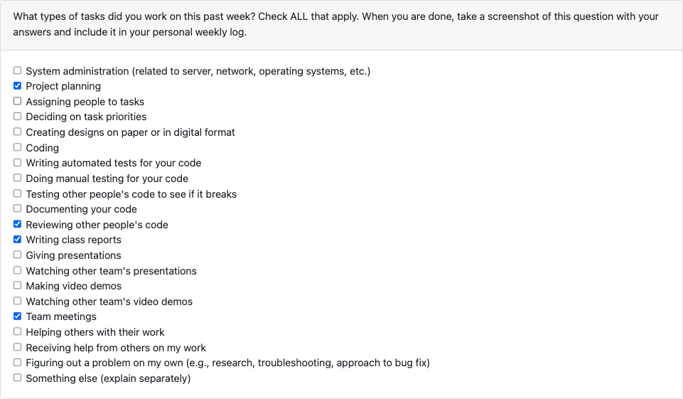

### Tasks

Tasks on board:

-   [Add project plan to repo #8](https://github.com/COSC-499-W2023/year-long-project-team-3/issues/8)

Tasks not on board:

-   Note-taking during the three team meetings we had this week
-   Writing up the project report for our team from those notes
-   Addressing feedback from my teammates
-   Adding empty files and templates for our personal and team logs

All tasks listed above were completed this week, so none are in progress.

### Goals

My goals this week were to brainstorm all tasks and finish the project plan.

### Additional Context

Since this week was a project planning week, we did not get started on features yet. We will start working on features next week.

## Teresa Saller - Week 5 (2023/10/02 - 2023/10/08)

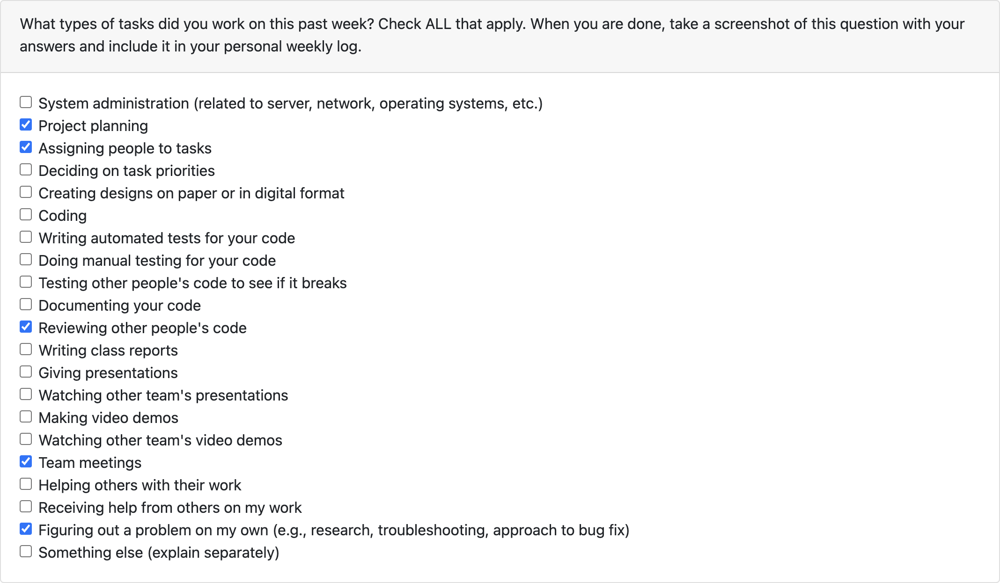

### Tasks

Completed:

-   [Update Project Board with Features#10](https://github.com/COSC-499-W2023/year-long-project-team-3/issues/10)
-   [Add PR template #37](https://github.com/COSC-499-W2023/year-long-project-team-3/issues/37)

In progress:

-   [Setup Cypress #52](https://github.com/COSC-499-W2023/year-long-project-team-3/issues/52)

This week, I updated the project board with all our features and added a PR template as part of our Initial Project Setup #24 feature.

### Goals

My goal this week was to help out Seth and Justin with project setup. I am hoping to finish setting up Cypress and maybe
start on our login/logout feature next week.

### Additional Context

This week was focused on setup, so not everyone was able to work on the project concurrently, as there were a lot of
dependencies.

## Teresa Saller - Week 6&7 (2023/10/09-2023/10/22)

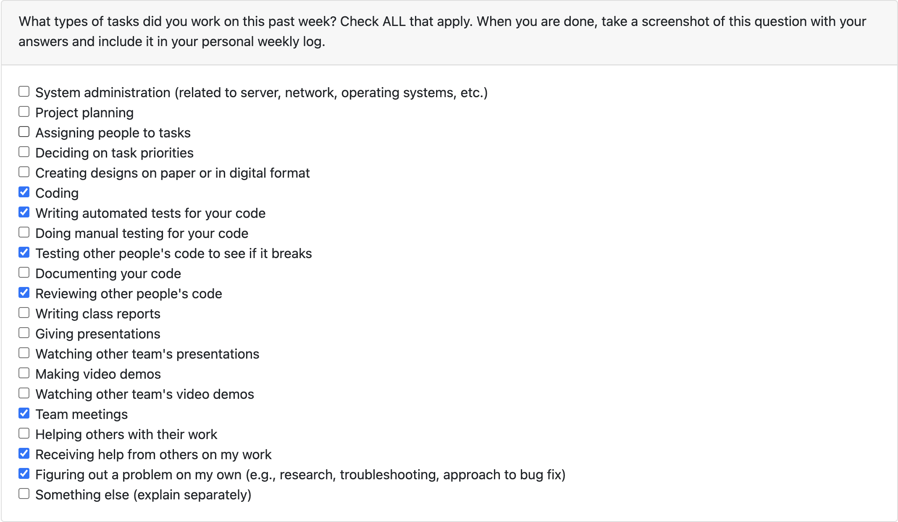

### Tasks

Completed:
- [Setup Cypress#52](https://github.com/COSC-499-W2023/year-long-project-team-3/issues/52)
- [Dockerize NextJs Application#30](https://github.com/COSC-499-W2023/year-long-project-team-3/issues/30)
- [React Tutorial](https://react.dev/learn/tutorial-tic-tac-toe)

In progress:
- [Refactoring test directory #109](https://github.com/COSC-499-W2023/year-long-project-team-3/pull/109)
- [NextJS Tutorial](https://nextjs.org/learn/basics/create-nextjs-app)

This week, I finished setting up our testing framework, Cypress. I also spent a lot of time going through tutorials for
the framework we are going to use, and dockerized our application to ensure operating system differences won't affect
development.

### Goals

My goal for this week was to finish setting up Cypress, which I accomplished. I was also planning on helping on login/
logout, but Erin has things under control, so I pivoted to doing more set-up work. My goal for next week is to have the
tutorial done and help my teammates wrap up any loose ends.

### Additional Context

## Teresa Saller - Week 8 (2023/10/23 - 2023/10/29)

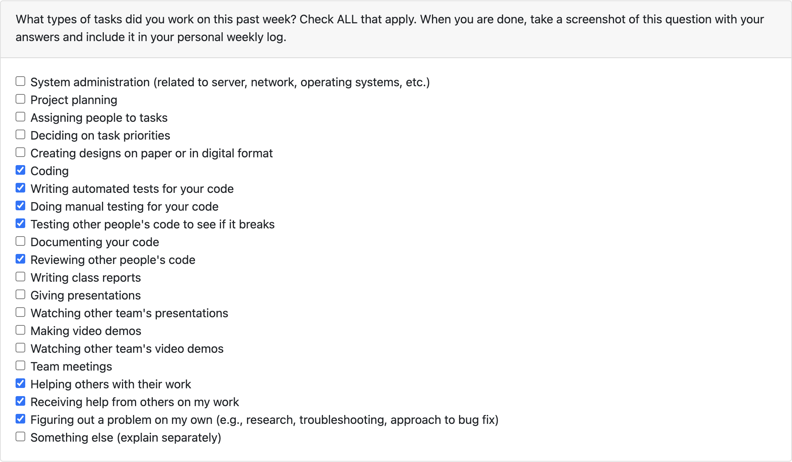

### Tasks

Completed:
- [NextJS Tutorial](https://nextjs.org/learn/basics/create-nextjs-app)

In progress:
- [Login #126](https://github.com/COSC-499-W2023/year-long-project-team-3/pull/126)

This week, I finished the NextJS tutorial. I have also been working on login.

### Goals

My goal for this week was to have the tutorial done and help my teammates wrap up any loose ends. My goal for next week
is to have login properly wrapped up (write tests and do better form validation) and give a good presentation. 

### Additional Context

My PR depends on Erin and K's PRs, so it will be the last to get merged.

## Teresa Saller - Week 9 (2023/10/30 - 2023/11/05)

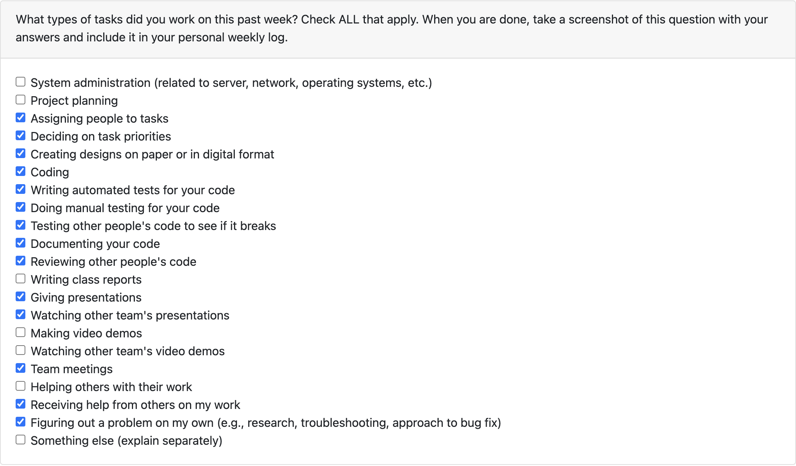

### Tasks

Completed:
- [Login #126](https://github.com/COSC-499-W2023/year-long-project-team-3/pull/126)
- [Add logo next to tab title #150](https://github.com/COSC-499-W2023/year-long-project-team-3/pull/150)

In progress:
- [Clicking on "Harp" takes you back to the landing page #161](https://github.com/COSC-499-W2023/year-long-project-team-3/pull/161)
- Make UI mocks for dashboard for sending videos

This week, I finished the Login PR. Our team spent quite a bit of time on presentation prep, and we were able to give a 
good presentation. I also worked on some minor UI fixes and got started making UI mocks for our dashboard.

### Goals

My goal for this week was to have login properly wrapped up (write tests and do better form validation) and give a good presentation.
My goal for next week is to continue working on my mocks while gathering feedback from my teammates.

### Additional Context

## Teresa Saller - Week 10 (2023/11/06 - 2023/11/12)

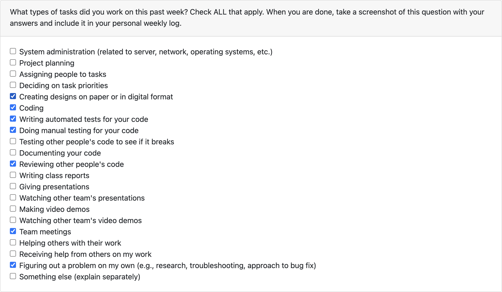

### Tasks

Completed:
- [Clicking on "Harp" takes you back to the landing page #161](https://github.com/COSC-499-W2023/year-long-project-team-3/pull/161)
- [Get rid of HTML form validator when missing '@' in email address #143](https://github.com/COSC-499-W2023/year-long-project-team-3/issues/143)
- [Re-Mock Login and Signup to comply with Google Branding #181](https://github.com/COSC-499-W2023/year-long-project-team-3/issues/181)

In progress:
- [Use sign in with Google branding guidelines #182](https://github.com/COSC-499-W2023/year-long-project-team-3/pull/182)
- [Make UI Mocks the Process of Sending Videos #165](https://github.com/COSC-499-W2023/year-long-project-team-3/issues/165)
  - [Mock Dashboard for Sending Videos #177](https://github.com/COSC-499-W2023/year-long-project-team-3/issues/177)
  - [Mock Recording Page #178](https://github.com/COSC-499-W2023/year-long-project-team-3/issues/178)
  - [Mock Editing Page #179](https://github.com/COSC-499-W2023/year-long-project-team-3/issues/179)
  - [Mock Submission Page #180](https://github.com/COSC-499-W2023/year-long-project-team-3/issues/180)

Figma: https://www.figma.com/file/eFSl7Qb39rXHptOUb0phj7/Sending-Videos-Dashboard-(Teresa)?type=design&mode=design&t=xgk8KDODSRV3GCaa-1

This week, I continued making UI mocks for our dashboard. They are currently being reviewed by the team. I also worked on
making our Signin with Google compliant with Google's branding guidelines and worked on some minor UI/bug fixes.

### Goals

My goal for this week was to continue working on my mocks while gathering feedback from my teammates.
My goal for next week is to finalize the mocks for the video sending process.

### Additional Context

## Teresa Saller - Week 12 (2023/11/13 - 2023/11/26)

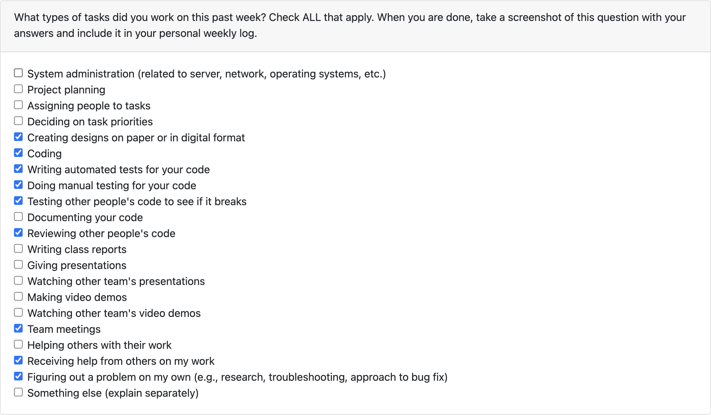

### Tasks

Completed:
- [Use sign in with Google branding guidelines #182](https://github.com/COSC-499-W2023/year-long-project-team-3/pull/182)
- [Make UI Mocks the Process of Sending Videos #165](https://github.com/COSC-499-W2023/year-long-project-team-3/issues/165)
  - [Mock Dashboard for Sending Videos #177](https://github.com/COSC-499-W2023/year-long-project-team-3/issues/177)
  - [Mock Recording Page #178](https://github.com/COSC-499-W2023/year-long-project-team-3/issues/178)
  - [Create mock for video preview page #152](https://github.com/COSC-499-W2023/year-long-project-team-3/issues/152)
  - [Mock Editing Page #179](https://github.com/COSC-499-W2023/year-long-project-team-3/issues/179)
  - [Mock Submission Page #180](https://github.com/COSC-499-W2023/year-long-project-team-3/issues/180)
- [Mocks for creating submission box #213](https://github.com/COSC-499-W2023/year-long-project-team-3/issues/213)
  - [Mock Create Box Form #216](https://github.com/COSC-499-W2023/year-long-project-team-3/issues/216)
  - [Mock Add Members Form #215](https://github.com/COSC-499-W2023/year-long-project-team-3/issues/215)
  - [Mock Add Members Form #215](https://github.com/COSC-499-W2023/year-long-project-team-3/issues/215)

In progress:
- [Submission Box Settings Form #221](https://github.com/COSC-499-W2023/year-long-project-team-3/pull/221)
- [Create form to add members to submission box #224](https://github.com/COSC-499-W2023/year-long-project-team-3/pull/224)

These last two weeks, I spent a lot of time finishing mocks for the process of sending videos and for creating submission
boxes. We also merged my Signin with Google branding guideline PR, and I have now been working on implementing the UI I
mocked out for the submission box forms.

### Goals

My goal for this week was to finalize the mocks for the video sending process. My goal for next week is to finish
implementing the forms that I started, and work on the design document for our team.

### Additional Context

## Teresa Saller - Week 13 (2023/11/27 - 2023/12/03)

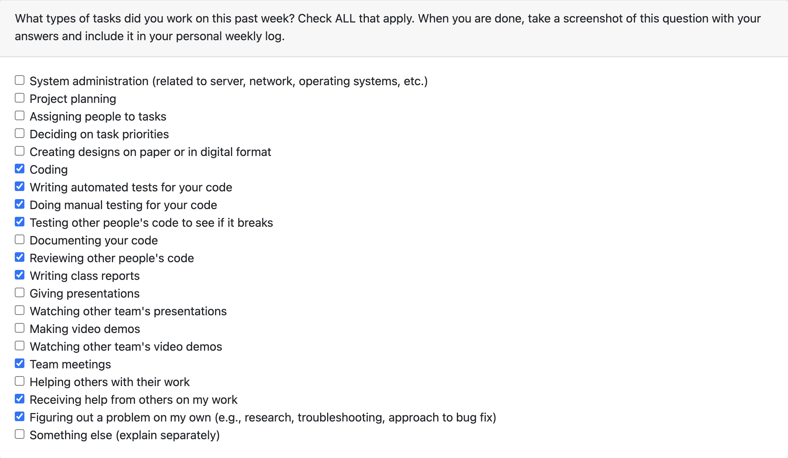

### Tasks

Completed:
- [Submission Box Settings Form #221](https://github.com/COSC-499-W2023/year-long-project-team-3/pull/221)
- [Submission Box Add Members Form #224](https://github.com/COSC-499-W2023/year-long-project-team-3/pull/224)
- [Rework submission box creation to be one page and add review page #248](https://github.com/COSC-499-W2023/year-long-project-team-3/pull/248)
- [Design document creation #63](https://github.com/COSC-499-W2023/year-long-project-team-3/issues/63)

In progress:

This last week, I spent over 30h testing and implementing the UI I mocked out for the submission box forms. I also spent
a considerable amount of time making diagrams for our user interaction flow and writing up our UI changes for the Design
Document.

### Goals

My goal for this week was to finish implementing the forms that I started, and work on the design document for our team.

### Additional Context

## Teresa Saller - Term 2: Week 1 (2024/01/08 - 2024/01/14)

### Tasks

Completed:
- [Choose either continue or next for navigation buttons #282](https://github.com/COSC-499-W2023/year-long-project-team-3/pull/282)

In progress:
- [Add Avatar and Dropdown instead of Sign Out Button #295](https://github.com/COSC-499-W2023/year-long-project-team-3/pull/295)

Researching ways to implement face-blurring using AWS, and another small UI improvement, see PR above.

### Goals

My goal for this week is to submit my UI improvement for review, and to put at least 6h into researching face-blurring.

### Additional Context

## Teresa Saller - Term 2: Week 2 (2024/01/15 - 2024/01/21)

### Tasks

Completed:
- [Research AWS Rekognition for face blurring #289](https://github.com/COSC-499-W2023/year-long-project-team-3/issues/289)
- [Add infrastructure for face blurring #302](https://github.com/orgs/COSC-499-W2023/projects/34/views/2?pane=issue&itemId=50057131)

In progress:
- [Add Avatar and Dropdown instead of Sign Out Button #295](https://github.com/COSC-499-W2023/year-long-project-team-3/pull/295)

We decided to focus more heavily on core features this week to be ready for peer-review. As part of this, I spent 20h+
this week researching AWS Rekognition and setting up infrastructure for faceblurring. As part of this:
- I set up the repo recommended by the client: https://github.com/aws-samples/rekognition-video-people-blurring-cdk
- I ran into and fixed the following errors:
  - `[ERROR]	2024-01-16T20:51:13.718Z	27912bcc-8966-4c3c-8899-468f1b5ae336	Lambda role does not have permission to call DetectFaces in Amazon Rekognition.`
    - needed to change region to us-west-2
  - `Error: fork/exec /lambda-entrypoint.sh: exec format error from cloud formation template`
    - needed to build the image for amd64 architecture, not arm64 which was the default for me since I am on an M2
- I brainstormed how to link the rekognition faceblurring pipeline to our existing streaming pipeline with @Hedgemon4 and we decided to use a lambda to transfer files between the rekognition output and streaming input bucket. This lambda also generates the metadata file containing the database id needed in the streaming pipeline. It does so using the video title. 

### Goals

My goal for this week is to help my team reach the goals we set for the peer-review deadline. If there is time, I would
like to implement logic to give the user a choice of whether they want their face blurred. Currently, we are always blurring
it.

### Additional Context

My code contributions for this week may look small, but that is because I spent so much time getting the pipeline to work.
None of what I did can really be tested easily, and this is the reason why I have not added any tests this week.

## Teresa Saller - Term 2: Week 3 (2024/01/22 - 2024/01/28)

### Tasks

Completed:
- [Video processing features #68](https://github.com/COSC-499-W2023/year-long-project-team-3/issues/68)
  - [Fixed file name issue and allowing for .mov upload #331](https://github.com/COSC-499-W2023/year-long-project-team-3/pull/331)
  - [Set up staging pipeline #332](https://github.com/COSC-499-W2023/year-long-project-team-3/issues/332)
  - [Set up deployment pipeline #333](https://github.com/COSC-499-W2023/year-long-project-team-3/issues/333)
  - [Allow user to choose whether to blur their face #342](https://github.com/COSC-499-W2023/year-long-project-team-3/pull/342)
- [Fix aspect ratio of thumbnail in review submit #338](https://github.com/COSC-499-W2023/year-long-project-team-3/pull/338)

In progress:
- [Transferring videos between buckets times out for longer videos #343](https://github.com/COSC-499-W2023/year-long-project-team-3/issues/343)

### Goals

My goal for this week was to help my team reach the goals we set for the peer-review deadline, and to potentially 
implement logic to give the user a choice of whether they want their face blurred. My goal for next week is to collect
good feedback in our peer-testing session, and to start fixing whatever issues the session uncovers. Also, I am currently
working on enabling larger files to be transferred between our rekognition and streaming pipelines.

### Additional Context

Since I worked a lot on infrastructure and bug testing, I only have one PR with tests.

## Teresa Saller - Term 2: Week 4 (2024/01/29 - 2024/02/04)

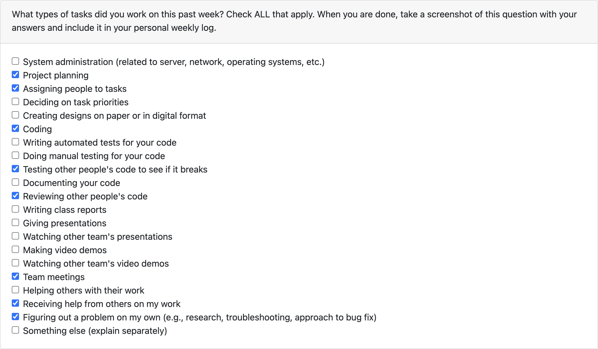

### Tasks

Completed:
- [Revamped Mission Statement #357](https://github.com/COSC-499-W2023/year-long-project-team-3/pull/357)
- [Removed edit tools on video edit page, renamed the page to preview #355](https://github.com/COSC-499-W2023/year-long-project-team-3/pull/355)
- [Add all tasks that came from peer-testing feedback to GitHub #375](https://github.com/COSC-499-W2023/year-long-project-team-3/issues/375)
- [Updated PR template now that actions work #404](https://github.com/COSC-499-W2023/year-long-project-team-3/pull/404)
- [Fix description #402](https://github.com/COSC-499-W2023/year-long-project-team-3/pull/402)

In progress:
- [Transferring videos between buckets times out for longer videos #343](https://github.com/COSC-499-W2023/year-long-project-team-3/issues/343)
- [Go to dashboard button after email verification is odd size #407](https://github.com/COSC-499-W2023/year-long-project-team-3/pull/407)

### Goals

My goal for this week was to collect good feedback in our peer-testing session, and to start fixing whatever issues the 
session uncovers. The feedback we received was generally positive, most of it just lead to smaller UI fixes. We discussed
features and brainstormed feedbacks in a team meeting and I added the [tasks we came up with](https://docs.google.com/document/d/1KsMm4D5D9PheCWpZ02yLwP1AJmBTkQgDxlyA0grJiUU/edit?usp=sharing)
to GitHub. Also, I have been working on enabling larger files to be transferred between our rekognition and streaming 
pipelines.

### Additional Context

Lot of work on infrastructure and planning

## Teresa Saller - Term 2: Week 5 (2024/02/05 - 2024/02/11)

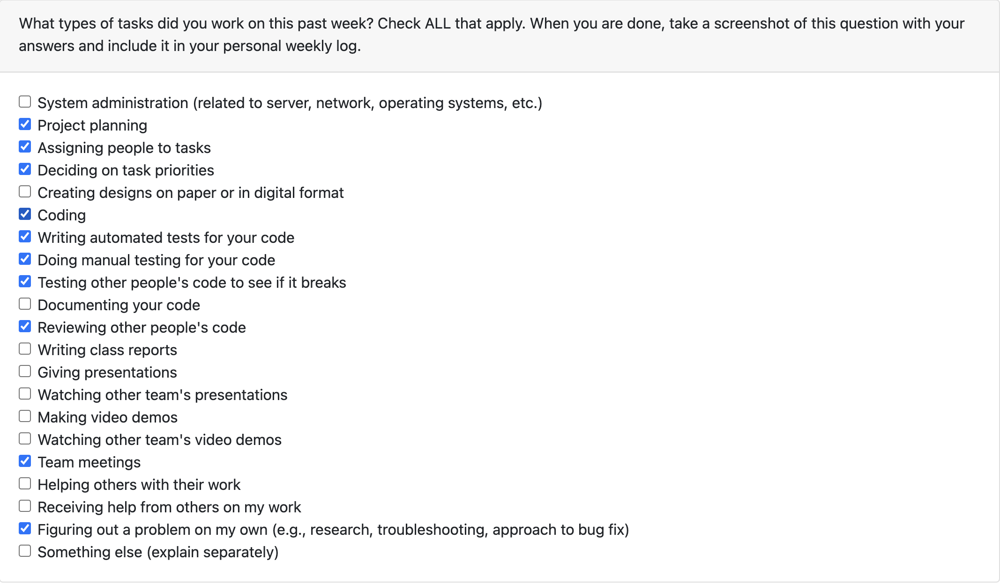

### Tasks

Completed:
- [Transferring videos between buckets times out for longer videos #343](https://github.com/COSC-499-W2023/year-long-project-team-3/issues/343)
- [Go to dashboard button after email verification is odd size #407](https://github.com/COSC-499-W2023/year-long-project-team-3/pull/407)

In progress:
- [Submission box email addition fixes #422](https://github.com/COSC-499-W2023/year-long-project-team-3/pull/422)
  - Couldn't merge today because we didn't have time to wait on the E2E tests again, hoping to merge tomorrow

### Goals

My goal for this week was to finish working on enabling larger files to be transferred between our rekognition and streaming
pipelines. I have also made a minor UI fix on the dashboard and made a bigger fix for submission box email addition, to 
address some of the feedback we received from the peer testing. My goal for this upcoming week is to look at designing
new cards for our dashboard.

### Additional Context

## Teresa Saller - Term 2: Week 5 (2024/02/05 - 2024/02/11)

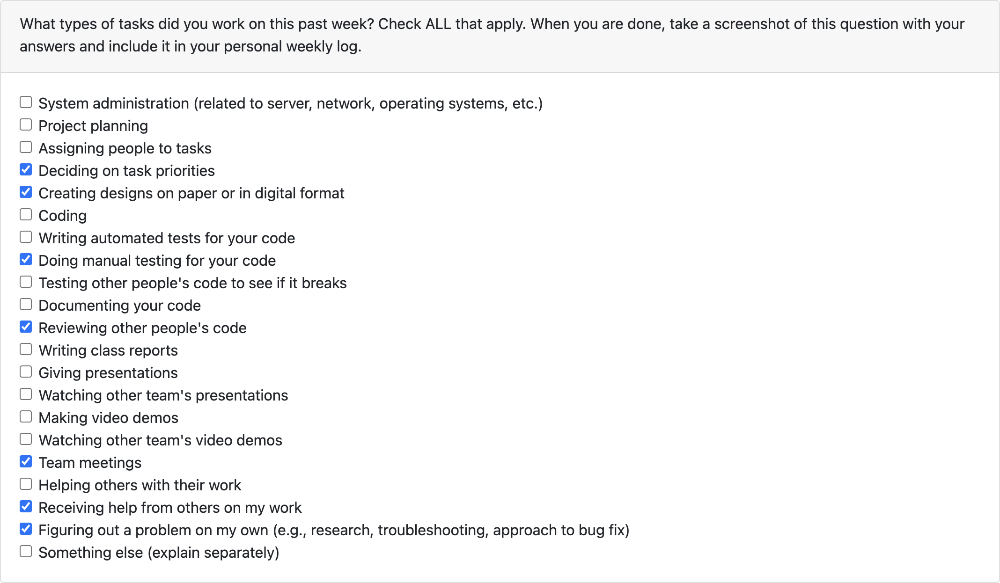

### Tasks

Completed:
- [Create Mocks for Video Cards on Figma #437](https://github.com/COSC-499-W2023/year-long-project-team-3/issues/437)
  - Designed a new card and improved it through team feedback

In progress:
- [Submission box email addition fixes #422](https://github.com/COSC-499-W2023/year-long-project-team-3/pull/422)
  - Done but cannot merge due to issue with tests in staging (tests pass locally)
- [Implement new video cards #449](https://github.com/COSC-499-W2023/year-long-project-team-3/pull/449)
  - Need to change API to make this work

### Goals

My goal for this week was to look at designing new cards for our dashboard. My goal for this upcoming week is to enjoy
reading break. After that, I am hoping to finish the PRs I currently have in progress.

### Additional Context

## Teresa Saller - Term 2: Week 8 (2024/02/26 - 2024/03/03)

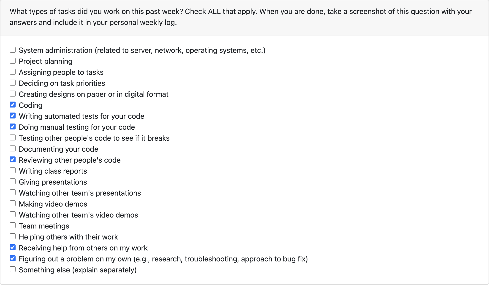

### Tasks

Completed:

In progress:
- [Submission box email addition fixes #422](https://github.com/COSC-499-W2023/year-long-project-team-3/pull/422)
  - Done but cannot merge due to issue with tests in staging (tests pass locally)
- [Implement new video cards #449](https://github.com/COSC-499-W2023/year-long-project-team-3/pull/449)
  - Done but cannot merge due to issue with tests in staging (tests pass locally)

### Goals

My goal for this week was to finish the PRs I currently have in progress. I have finished them, but have not been able
to merge them because I have encountered issue with flaky tests in the CI pipeline that we have not been able to solve.

### Additional Context

## Teresa Saller - Term 2: Week 9 (2024/03/04 - 2024/03/10)

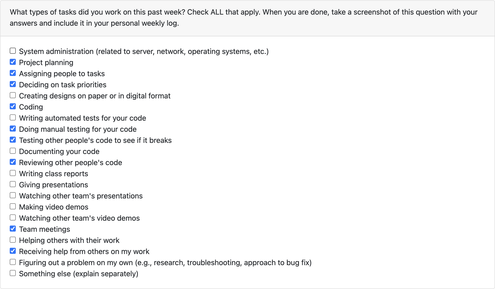

### Tasks

Completed:
- [Submission box email addition fixes #422](https://github.com/COSC-499-W2023/year-long-project-team-3/pull/422)
  - Was able to fix and merge thanks to Justin's help
- [Implement new video cards #449](https://github.com/COSC-499-W2023/year-long-project-team-3/pull/449)
  - Was able to fix and merge thanks to Justin's help
- [Reworked Learn More page #479](https://github.com/COSC-499-W2023/year-long-project-team-3/pull/479)
- [Redirecting to submission box page after creation #485](https://github.com/COSC-499-W2023/year-long-project-team-3/pull/485)
- Created issues in GitHub for all the feedback we collected from Peer Testing #2

In progress:

### Goals

My goal for this week was to merge the PRs that were having issues with flaky tests. I was able to merge them with Justin's help.
My goal for this upcoming week is to continue working on addressing feedback from our peer-testing.

### Additional Context

## Teresa Saller - Term 2: Week 10 (2024/03/11 - 2024/03/17)

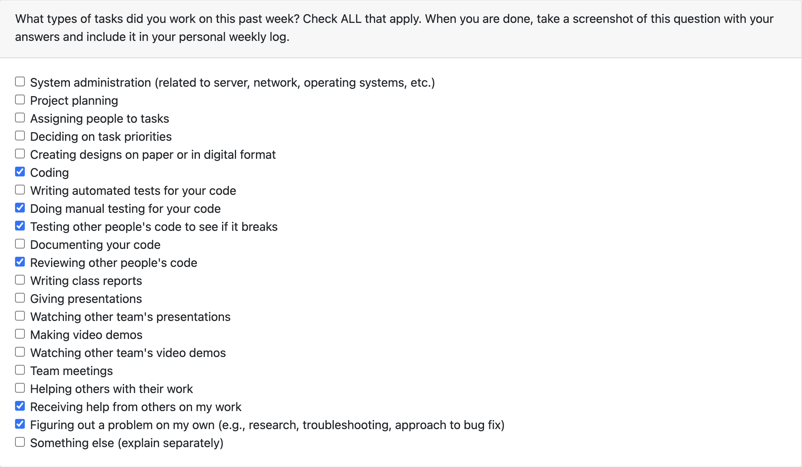

### Tasks

Completed:
- [Create Mocks for Submission Box Cards on Figma #438](https://github.com/COSC-499-W2023/year-long-project-team-3/issues/438)
- [Implement new manage boxes card #493](https://github.com/COSC-499-W2023/year-long-project-team-3/pull/493)

In progress:

### Goals

My goal for this week to continue working on addressing feedback from our peer-testing. I mocked out new submission box
cards and implemented them as part of this process. My goal for next week is to fix some UI issues on the website.

### Additional Context