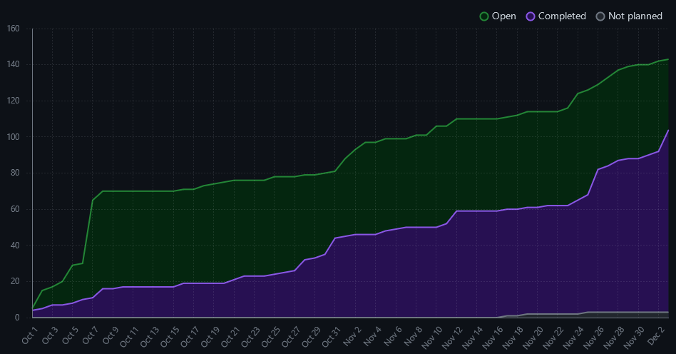
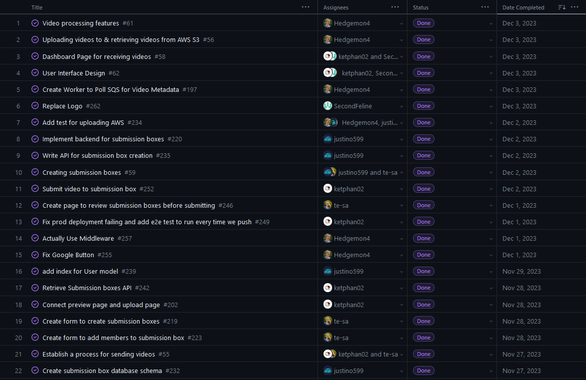
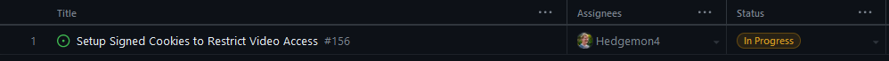
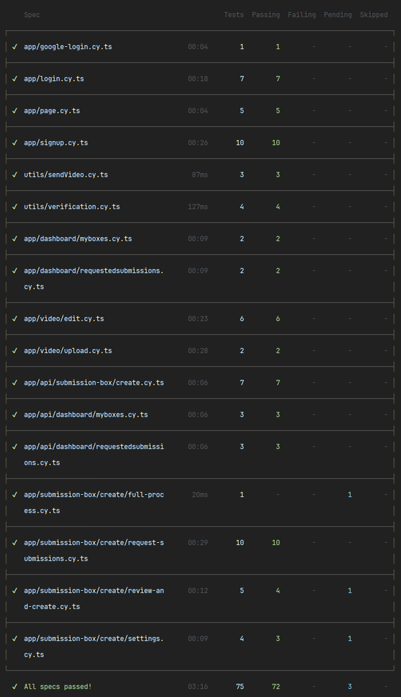
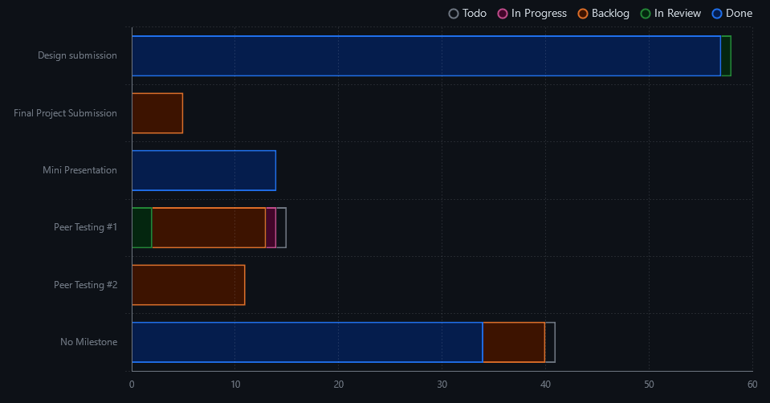

# Weekly Team Log

## Team 3 - Week 13 (27/11/2023 - 03/12/2023)

### Milestone Goals

-   Establish a process for sending videos, including dashboard page and setup basic page structure for video submission
-   Uploading videos to AWS S3 and retrieving them from AWS S3
-   Previewing video in the browser: nice video playing with keyboard shortcuts, setting speed, full-screen mode etc
-   Dashboard Page for receiving videos (see all received videos)
-   Creating submission boxes (date opened, max time video will be stored, name of submission box, date it will close, who videos are requested from, max video length)
-   Video processing features (API calls to AWS), e.g. face blurring and background blurring
-   User Interface Design
-   Design document creation
-   Video creation

### Burn-up Chart

### Usernames

-   @Hedgemon4 - Seth Akins
-   @SecondFeline - Erin Hiebert
-   @ketphan02 - K Phan
-   @te-sa - Teresa Saller
-   @justino599 - Justin Schoenit

### Completed Tasks

### In-progress Tasks

### Test Report

### Milestone Progress

### Additional Context
