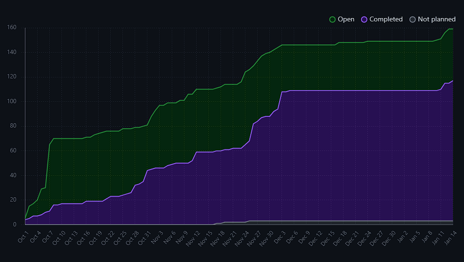
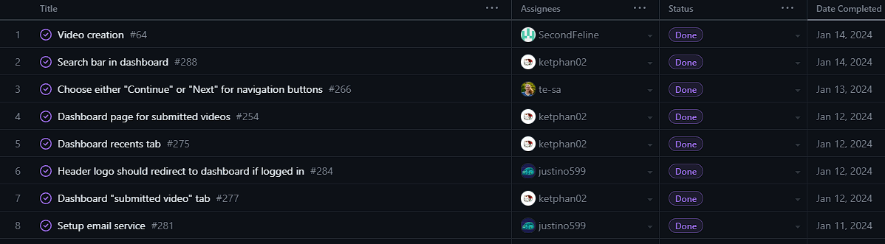
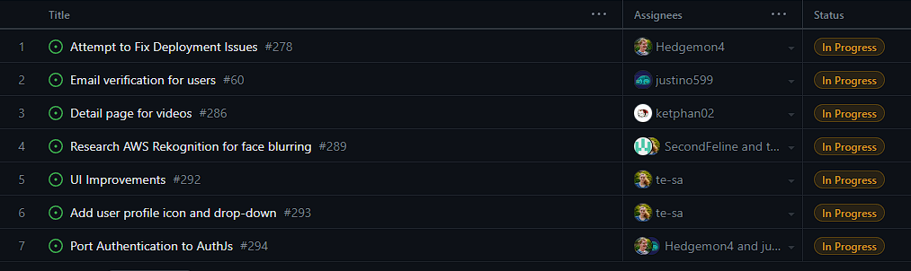
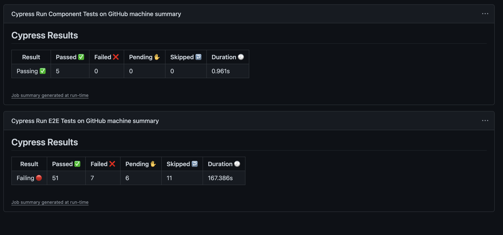
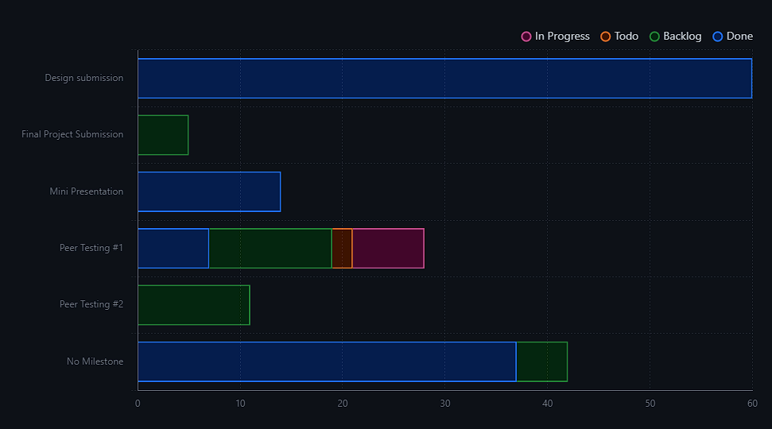

# Weekly Team Log

## Team 3 - Week 1 Term 2 (2024/01/08 - 2024/01/14)

### Milestone Goals

-   Video processing features (API calls to AWS) - Teresa
-   Filter/search for videos by title, date, and person that submitted - K
-   Invite links for submission boxes (including emails) - Justin
-   Modifying submission boxes (update/delete), and allowing multiple submissions to the same box - Erin
-   Dashboard Page for recently viewed/sent videos, and relevant submission boxes - K
-   Detail/edit page for videos - K
-   Detail/edit page for submission boxes - Erin
-   Email notifications: reminders for submission boxes (if they have been opened or close soon), submission sent/received, and comments received - Justin
-   Dockerize deployment of application (NextJS application and poll worker) - Seth
-   Fix issues with GitHub actions, migrate test deployment to use docker, and add an automatic build of the container when a branch is merged. - Seth 

### Burn-up Chart

    
### Usernames

-   @Hedgemon4 - Seth Akins
-   @SecondFeline - Erin Hiebert
-   @ketphan02 - K Phan
-   @te-sa - Teresa Saller
-   @justino599 - Justin Schoenit

### Completed Tasks

### In-progress Tasks

### Test Report

Failing tests are because we are deployed on Vercel, and we don't have access to an IAM Role for AWS, so we can't access AWS related stuff for the tests. We plan on deploying on AWS via a docker image, which will mean we don't need the IAM Role

### Milestone Progress

### Additional Context

Some progress was delayed this week due to unforeseen issues with deploying the project on AWS rather than Vercel. NextAuth has been problematic since it uses the Edge Runtime instead of the Node.js runtime. This greatly restricts the features available to it, including loading environment variables or discovering API routes. To fix this we think by upgrading to the newest version of NextAuth, it should be able to do these things.
