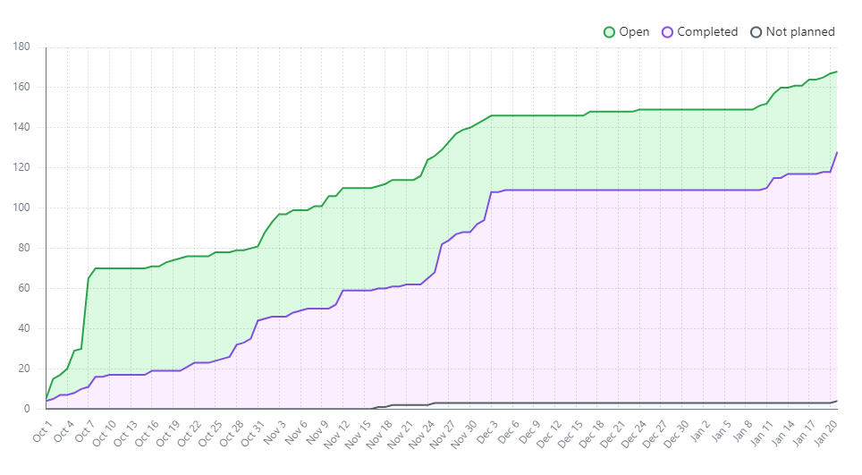
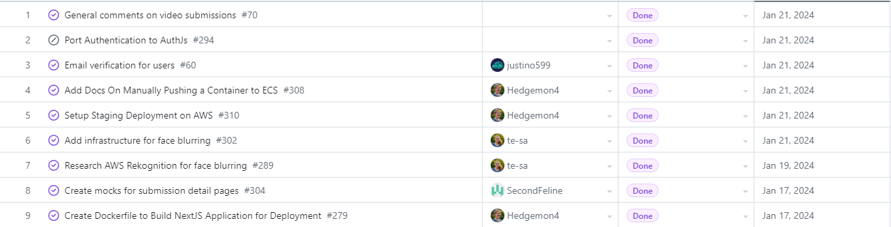
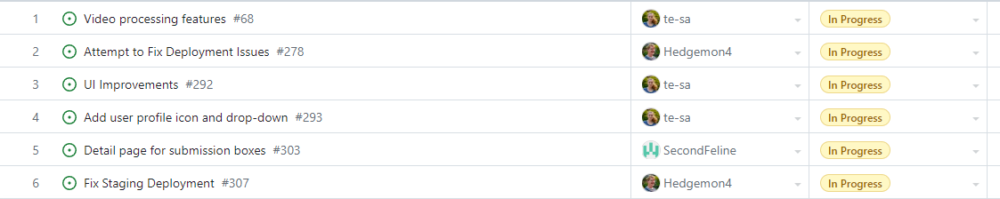
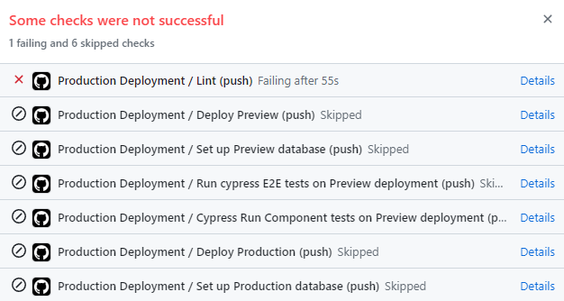
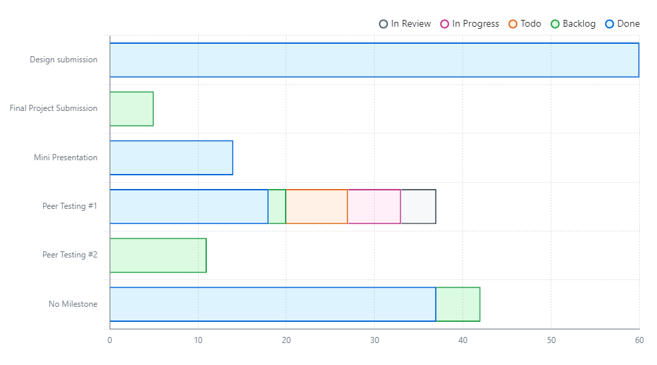

# Weekly Team Log

## Team 3 - Week 2 Term 2 (2024/01/15 - 2024/01/21)

### Milestone Goals

-   Video processing features (API calls to AWS) - Teresa
-   Filter/search for videos by title, date, and person that submitted - K
-   Invite links for submission boxes (including emails) - Justin
-   Modifying submission boxes (update/delete), and allowing multiple submissions to the same box - Erin
-   Dashboard Page for recently viewed/sent videos, and relevant submission boxes - K
-   Detail/edit page for videos - K
-   Detail/edit page for submission boxes - Erin
-   Email notifications: reminders for submission boxes (if they have been opened or close soon), submission sent/received, and comments received - Justin
-   Dockerize deployment of application (NextJS application and poll worker) - Seth
-   Fix issues with GitHub actions, migrate test deployment to use docker, and add an automatic build of the container when a branch is merged. - Seth

### Burn-up Chart

### Usernames

-   @Hedgemon4 - Seth Akins
-   @SecondFeline - Erin Hiebert
-   @ketphan02 - K Phan
-   @te-sa - Teresa Saller
-   @justino599 - Justin Schoenit

### Completed Tasks

### In-progress Tasks

### Test Report

Failing tests are because we are deployed on Vercel, and we don't have access to an IAM Role for AWS, so we can't access AWS related stuff for the tests. We plan on deploying on AWS via a docker image, which will mean we don't need the IAM Role.
Failing tests are also caused by the migration procedures. We are currently finish 1/3 steps out of migration, this pipeline will not be failing next week, finger crossed.

### Milestone Progress

### Additional Context

- For this and the upcoming weeks, much of the tasks has required work, research, and configuration on AWS which is not 
  tracked by GitHub. This has been documented in the logs of the individuals it concerns.
- Also, the AWS tasks cannot easily be tested by our application. We can only really look at the input and output
  results we see from AWS. As such, we really only have end to end tests for it.
