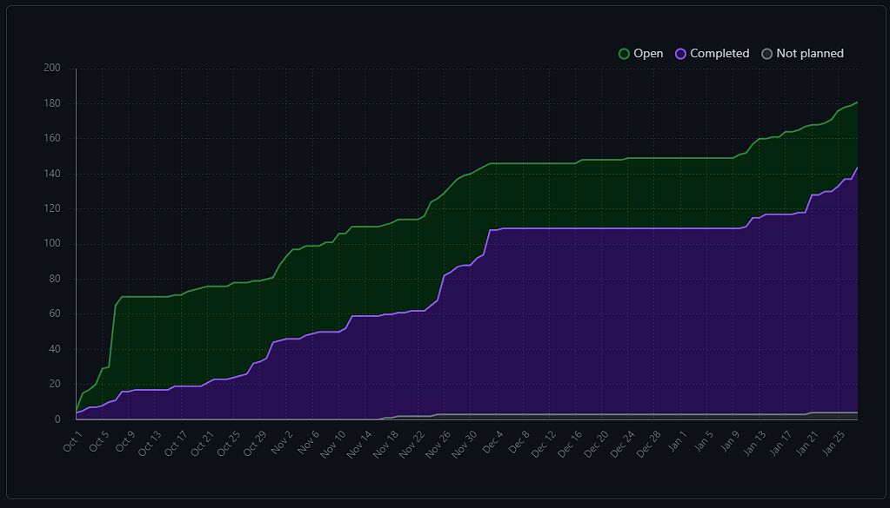
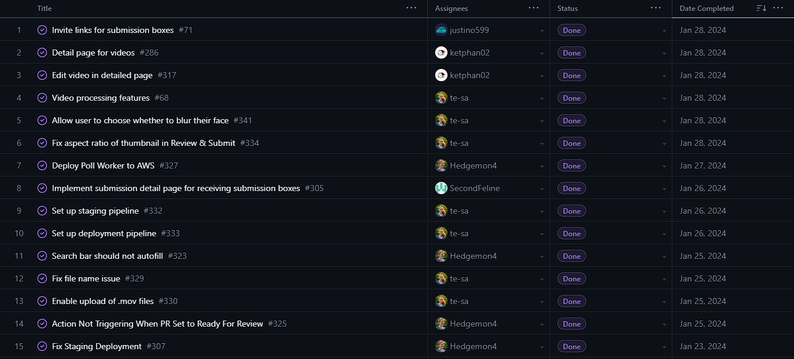
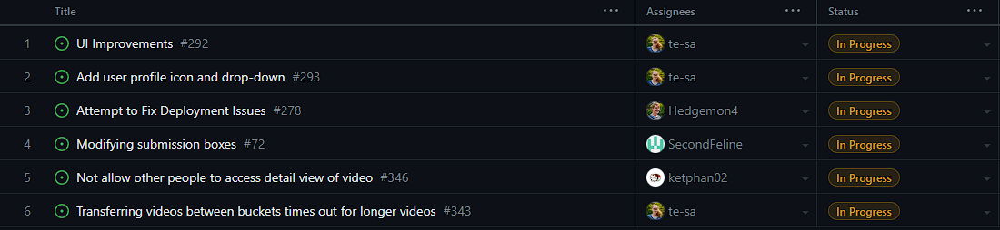
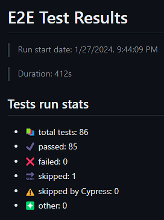
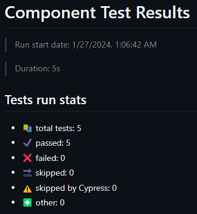
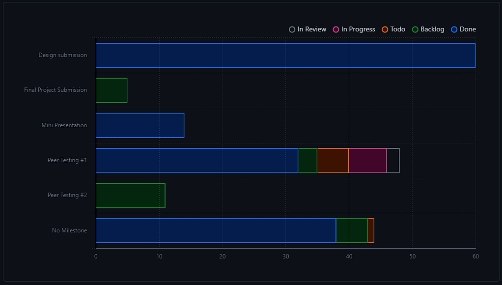

# Weekly Team Log

## Team 3 - Week 3 Term 2 (2024/01/22 - 2024/01/28)

### Milestone Goals

-   Video processing features (API calls to AWS) - Teresa
-   Filter/search for videos by title, date, and person that submitted - K
-   Invite links for submission boxes (including emails) - Justin
-   Modifying submission boxes (update/delete), and allowing multiple submissions to the same box - Erin
-   Dashboard Page for recently viewed/sent videos, and relevant submission boxes - K
-   Detail/edit page for videos - K
-   Detail/edit page for submission boxes - Erin
-   Email notifications: reminders for submission boxes (if they have been opened or close soon), submission sent/received, and comments received - Justin
-   Dockerize deployment of application (NextJS application and poll worker) - Seth
-   Fix issues with GitHub actions, migrate test deployment to use docker, and add an automatic build of the container when a branch is merged. - Seth

### Burn-up Chart

### Usernames

-   @Hedgemon4 - Seth Akins
-   @SecondFeline - Erin Hiebert
-   @ketphan02 - K Phan
-   @te-sa - Teresa Saller
-   @justino599 - Justin Schoenit

### Completed Tasks

### In-progress Tasks

### Test Report

Tests are back up and working this week! Seth has been hard at work getting everything setup on our AWS staging server so that GitHub actions can run tests on a deployed version of our site. This is possible because we are no longer deployed on Vercel, which prevented us from accessing AWS resources. For now, the tests run on PRs before they are merged, but in the future we hope to have them run on the production site as well, since that is also important.

### Milestone Progress

### Additional Context

- For this and the upcoming weeks, much of the tasks has required work, research, and configuration on AWS which is not 
  tracked by GitHub. This has been documented in the logs of the individuals it concerns.
- Also, the AWS tasks cannot easily be tested by our application. We can only really look at the input and output
  results we see from AWS. As such, we really only have end to end tests for it.
