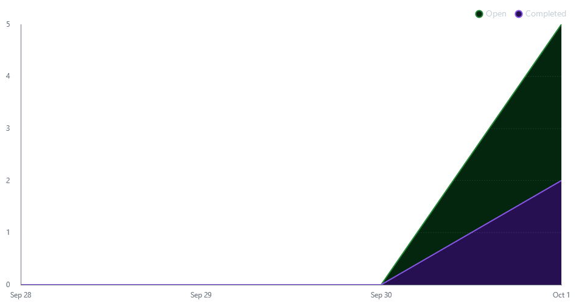
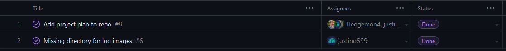
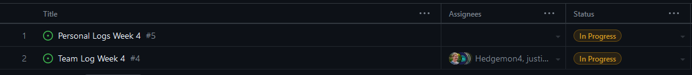

# Weekly Team Log - Team 3

## Week 4 (25/09/2023 - 01/10/2023)

### Milestone Goals

-   This week was focused on developing our project plan
    -   This included a couple of in-person meetings to discuss the scope of our project and the features we wanted to develop for this project.
    -   Research was also conducted this week to help with the project plan.
    -   Complete project plan, team logs, and individual logs
    -   Setup project board on year long weekend

### Burn-up Chart

### Usernames

-   @justino599 - Justin Schoenit
-   @Hedgemon4 - Seth Akins
-   @SecondFeline - Erin Hiebert
-   @ketphan02 - K Phan
-   @te-sa - Teresa Saller

### Completed Tasks

### In-progress Tasks

### Test Report

-   We did not start coding yet, so we do not have a test report for this week.

### Additional Context

-   No additional context for this week
