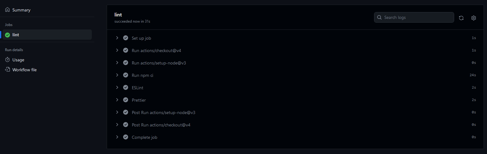

# Weekly Team Log - Team 3

## Week 5 (02/10/2023 - 08/10/2023)

### Milestone Goals

-   This week was focused on setting up our project and configuring our individual development environments.
-   The following tasks were completed this week for project setup:
    -   Initalized our repo with NextJS Project #19
    -   Added Prettier to project #23
    -   Added Prisma to project #29
    -   Setup Docker Container for Database #20
    -   Added Material UI to project #26
    -   Added basic PR template #37
-   Team discussions on tech stack
-   Involved discussing the need for jest and SASS to be added to project
-   Some inital work on user creation was also started this week #33

### Burn-up Chart

### Usernames

-   @justino599 - Justin Schoenit
-   @Hedgemon4 - Seth Akins
-   @SecondFeline - Erin Hiebert
-   @ketphan02 - K Phan
-   @te-sa - Teresa Saller

### Completed Tasks

### In-progress Tasks

### Test Report

### Additional Context

-   This week involved mainly the setup and dependancies added to the project
