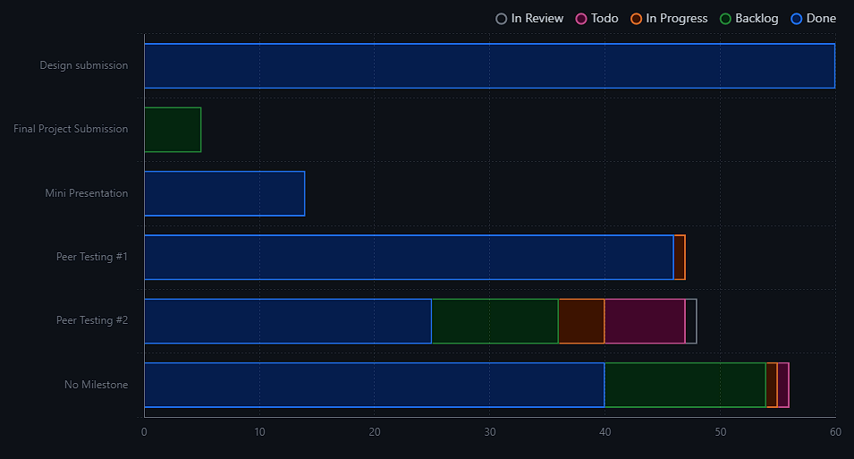

# Weekly Team Log

## Team 3 - Week 6 Term 2 (2024/02/12 - 2024/02/18)

### Milestone Goals

Bug Fixes:
- Redirects should be cleared when logging out (Erin)
- ~~Fix Permissions issue on videos & submission boxes (K)~~
- ~~.toLowercase on email (Justin)~~
- ~~Should automatically send verification email and have resend button (Justin)~~
- ~~Fix transfer lambda to enable upload of larger files (Teresa)~~

UI Fixes:
- ~~Add (optional) beside closing date (Seth)~~
- Prevent user to submit to closed submission boxes (Justin)
- Add a title to each tab (Erin)
- ~~App description generated by NextJS, fix (visible when sending link to app to someone on Discord) (Teresa)~~
- ~~Requested emails should be on submission box, also indicate how many submissions out of x (Erin)~~
- If clicked on video inside box, should be able to return to box (Justin)
- Remove scrollbars where they don’t belong (title and email box) (K)
- ~~Grey out upload new if user can’t submit yet (Seth)~~
- ~~On video card should say who submitted and when (K)~~
- ~~Go to Dashboard button after email verification is odd size (fix that) (Teresa)~~
- ~~Add scrolling where needed (main page, signup page) (Seth)~~
- ~~Make + icon blue, auto-add any unsubmitted emails to the box, write “No one invited yet” in gray text, maybe add a pop-up: Add warning on review: “Hey, you haven’t added anyone, do you wish to proceed?” (Teresa)~~
- ~~Add to header: Dashboard, Learn More (info icon) (K)~~
- ~~Figure out terminology around submission boxes/video requests (ALL)~~

Nice to have:
- Video deletion
- Add dark mode
- Visual tags on cards to indicate whether it’s submitted or received
- Add Badge to My Invitations (indicating number of new requests)
- Navigate to correct part of dashboard when returning (e.g. submission boxes after creating one)
- Add info icons to page
- ~~Should be able to access video that is upload in progress (or fix text on page to tell them to stay on the page)~~
- Be able to record in browser
- Comments feature
- Display who’s logged in

UI/UX Redesign
- New upload video form
  - Make page
  - Make API
- Dashboard
  - ~~New sidebar~~
  - New cards
- Submit to a box from video page
- Submit a video from submission box page

### Burn-up Chart

### Usernames

-   @Hedgemon4 - Seth Akins
-   @SecondFeline - Erin Hiebert
-   @ketphan02 - K Phan
-   @te-sa - Teresa Saller
-   @justino599 - Justin Schoenit

### Completed Tasks

### In-progress Tasks

### Test Report

### Milestone Progress

### Additional Context

Nothing was merged this week. There are number of tasks in progress that are larger than one week's worth of work.
