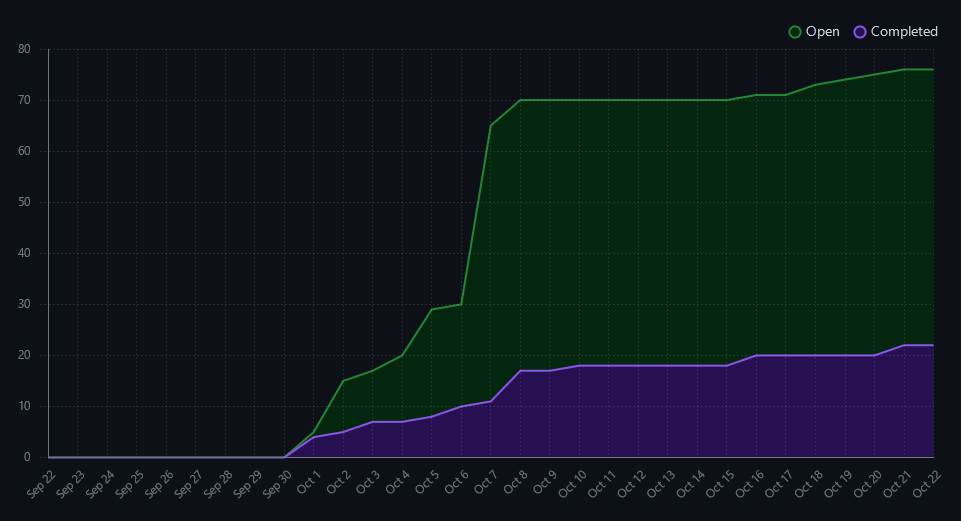
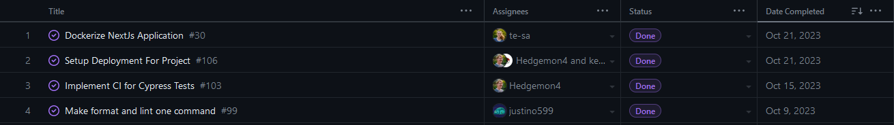
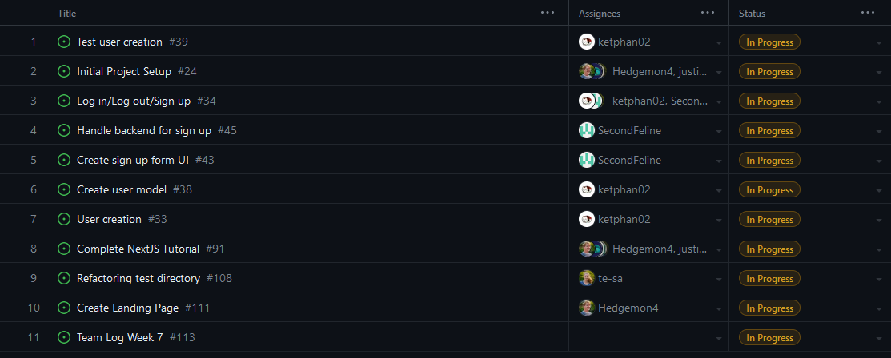
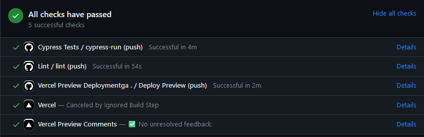
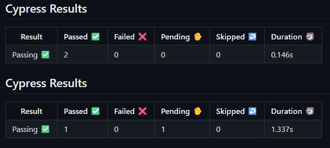

# Weekly Team Log

## Team 3 - Week 6&7 (09/10/2023 - 22/10/2023)

### Milestone Goals

-   Project and Environment setup (dockerization, setting up CI + linting, database setup)
-   User account creation, login and logout

### Burn-up Chart

### Usernames

-   @justino599 - Justin Schoenit
-   @Hedgemon4 - Seth Akins
-   @SecondFeline - Erin Hiebert
-   @ketphan02 - K Phan
-   @te-sa - Teresa Saller

### Completed Tasks

### In-progress Tasks

### Test Report

### Additional Context

- A lot of time this week was spent on tutorials and research. Most team members are done the Next.Js tutorial (~5h).
- Additionally, time was spent on researching and flushing out our CI/CD pipeline
