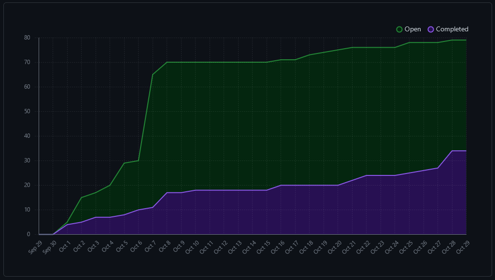

# Weekly Team Log

## Team 3 - Week 8 (23/10/2023 - 29/10/2023)

### Milestone Goals

-   Project and Environment setup (dockerization, setting up CI + linting, database setup)
-   User account creation, login and logout

### Burn-up Chart

### Usernames

-   @justino599 - Justin Schoenit
-   @Hedgemon4 - Seth Akins
-   @SecondFeline - Erin Hiebert
-   @ketphan02 - K Phan
-   @te-sa - Teresa Saller

### Completed Tasks

### In-progress Tasks

### Test Report

### Additional Context

Our team struggled with merging PRs and being able to effectively divide up the task. We did not quite finish everything
we wanted to have done for the mini presentation. Everything is in a PR, we are just waiting to merge it and make sure
that everything is fully tested.
